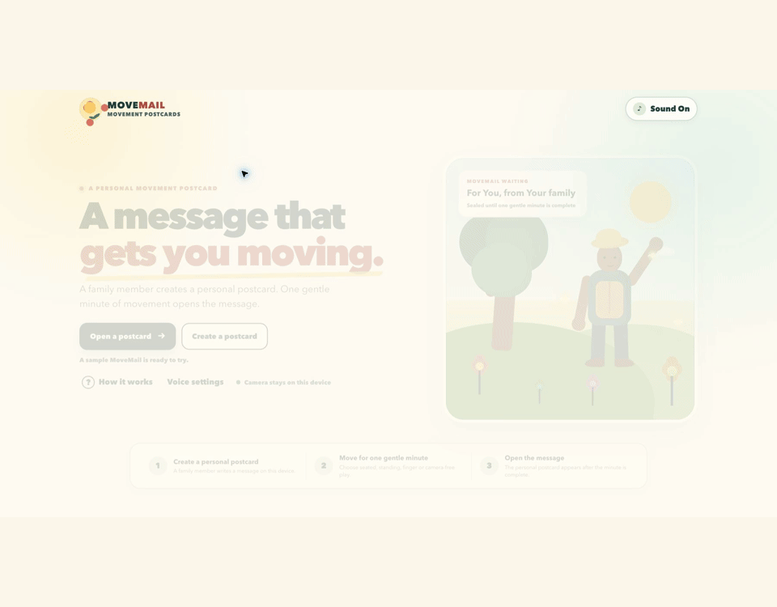
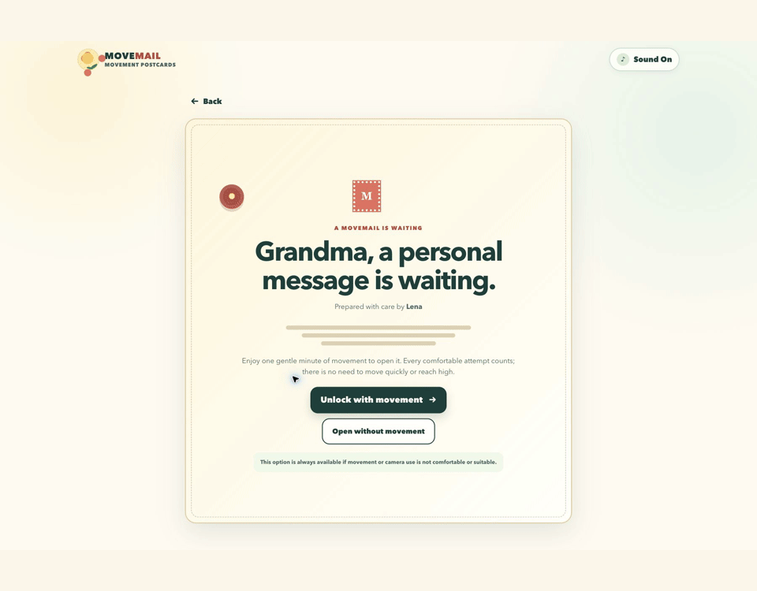
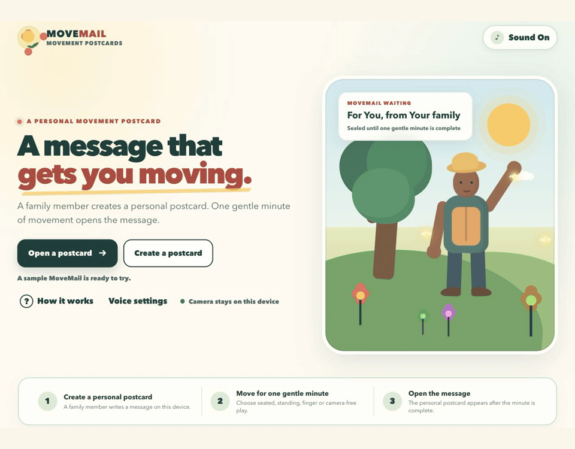

# MoveMail

**A personal message opened through one gentle minute of movement**

**[Try the live MoveMail demo](https://movemail-blush.vercel.app/)**

MoveMail is a browser-based movement-postcard MVP. A family member writes a
personal message on the device, opens the sealed recipient view, then hands the
device to the recipient. The recipient chooses Standing Play, Seated Play,
Finger Play or Camera-free Play and takes part for 60 active seconds. The
personal message is rendered only after the minute is complete or the recipient
deliberately uses the accessible non-movement route.

The game rewards participation, not precision. Recognition adds encouragement
but never controls access to the message. If the recipient needs to stop early,
an explicit safety bypass lets them read it without continuing to move.

> **Safety:** Use a clear space, keep a stable chair or support nearby and wear
> secure footwear. Move only at a comfortable pace. Stop immediately if you
> feel pain, dizziness, discomfort or instability. Anyone who may need
> assistance should play with a family member, carer or appropriate
> professional present. For Finger Play, keep the hand and wrist relaxed and
> avoid any shape or repeated movement that causes strain.

## Product walkthroughs

### Create a personal postcard

A family member writes a personal message, seals it and opens the same-device
recipient handover.



### Choose a comfortable way to play

Standing, seated, finger-tracking and camera-free routes count equally. The
camera-free route includes the same safety checks and gentle one-minute format
without requesting camera access.



### Preview the movement unlock

The game uses clear prompts, forgiving participation-based encouragement and
an always-visible option to pause or end the session.



## What is included

- Create one sanitised local postcard with recipient, sender and a message of
  up to 280 characters.
- Hand the same device to the recipient; the local MVP clearly states that it
  does not email, text, remotely deliver or store a cloud copy of the postcard.
  Optional online read-aloud is a separate, confirmed speech request.
- Keep the general Create route blank so a locked message is not exposed after
  handover; replacement and deletion require confirmation.
- Complete a 60-second active-time movement game. Pauses and time spent in a
  hidden browser tab do not count towards the minute.
- Work through up to 10 body or hand prompts during the minute.
- Four mini-games: Copy the Gardener, Catch the Fireflies, Rhythm Garden and
  Garden Celebration.
- Standing and seated pose recognition with forgiving, body-relative
  thresholds.
- Finger Play with local one-hand tracking, seven forgiving hand shapes and
  10 challenges across four mini-games.
- A complete Camera-free Play mode that never requests camera access and simulates
  successful movement.
- Large text, high contrast, large controls, visible keyboard focus and simple
  screen-by-screen navigation.
- Optional spoken instructions, generated sound effects and a consistent sound
  toggle across screens.
- A Voice settings page with device speech as the default and an optional
  ElevenLabs voice for spoken guidance.
- Explicit, postcard-specific permission and a second confirmation before any
  personal message text is sent to ElevenLabs for read-aloud.
- Pause, resume, restart, safe early stop, an always-available non-movement
  access route, return-home and replay controls.
- Calm recovery messages if the camera, body tracking, speech or local storage
  is unavailable.
- A local session history containing only date, mode, duration, completed
  movements and star score, plus one separately stored local postcard.

## Requirements

- A laptop or desktop computer is the primary target. The responsive styles
  also target tablet landscape, large displays and mobile layouts, but those
  layouts still require a fresh visual validation pass.
- A current version of Chrome, Edge or Safari is the intended browser target.
  This release has not been independently exercised in all three.
- A webcam for Standing Play, Seated Play or Finger Play. Camera-free Play does not
  need one.
- Node.js 22 or newer for the secure local server and ElevenLabs integration.
- Python 3 is an optional fallback for the device-voice version only.

The movement game, camera processing and device voice do not require an
account, paid API or internet connection. ElevenLabs is optional and requires
an ElevenLabs account, API key, internet connection and available account
credit. The pose and hand models, JavaScript bundle and WebAssembly files stay
inside the project.

## Configure ElevenLabs voice

Device voice is selected by default. To enable ElevenLabs:

1. Create or copy an API key by following the
   [ElevenLabs authentication guidance](https://elevenlabs.io/docs/api-reference/authentication).
2. Copy `.env.example` to a new file named `.env.local` in the `movemail`
   folder.
3. Replace the placeholder with the API key:

   ```text
   ELEVENLABS_API_KEY=your_elevenlabs_api_key_here
   ```

4. Restart MoveMail with the supplied launch script.
5. Open **Voice settings**, check the connection, choose a voice and save.

The API key is read only by the local Node server. It is not sent to the
browser, included in the built site or saved in browser storage. `.env.local`
is ignored by Git, but it is still a plaintext secret on the computer; protect
the user account and use a restricted ElevenLabs key with a suitable credit
limit.

Online game guidance sends the words being spoken to ElevenLabs. Personal
postcard reading is separately off by default. Enabling it applies only to the
current postcard, and **Read with ElevenLabs** asks for confirmation before it
sends the message text. Names, camera images, landmarks and session results
are not included. ElevenLabs may retain submitted text and generated audio
under the connected account’s settings.

## Hosted Vercel version

The production site is
[https://movemail-blush.vercel.app](https://movemail-blush.vercel.app).
It contains the complete movement game, local camera processing, local models,
browser storage and device voice.

ElevenLabs is deliberately disabled on the public site. The local proxy’s
in-memory request limit is suitable for a trusted loopback service, but it is
not a durable spending control across public serverless instances. Do not add
`ELEVENLABS_API_KEY` to the Vercel project until the speech route has real
user or session authorisation, shared rate limiting and a Vercel Firewall
rule. Also use an
[ElevenLabs key with restricted scopes and a credit limit](https://elevenlabs.io/docs/overview/administration/workspaces/api-keys).

Postcards, results and voice preferences remain in the current browser origin.
Data saved on `localhost` is therefore separate from data saved on the Vercel
site. Neither version remotely delivers a postcard to another device.

## Launch on macOS

1. Extract the ZIP before launching the game.
2. In Finder, open the extracted `movemail` folder.
3. Double-click `start-mac.command`.
4. If macOS blocks the script the first time, Control-click it, choose
   **Open**, then confirm **Open**.
5. Your default browser should open
   [http://localhost:8080](http://localhost:8080). If it does not, enter that
   address manually.

Alternatively, open Terminal, change into the extracted folder and run:

```sh
chmod +x start-mac.command
./start-mac.command
```

To stop the server, return to the Terminal window and press **Control+C**.

## Launch on Windows

1. Extract the ZIP before launching the game.
2. Open the extracted `movemail` folder.
3. Double-click `start-windows.bat`.
4. A command window will remain open while the game runs. Your default browser
   should open [http://localhost:8080](http://localhost:8080). If it does not,
   enter that address manually.

From Command Prompt, the equivalent commands are:

```bat
cd C:\path\to\movemail
start-windows.bat
```

The script uses Node.js when available. Without Node, it tries the Windows
Python launcher (`py -3`) and then `python`; that fallback keeps device speech
but does not enable ElevenLabs.

To stop the server, return to the command window and press **Control+C**, then
close the window.

## Launch on Linux

1. Extract the ZIP.
2. Open a terminal in the extracted `movemail` folder.
3. Run:

```sh
chmod +x start-linux.sh
./start-linux.sh
```

4. The script should open
   [http://localhost:8080](http://localhost:8080). If it does not, enter that
   address manually.

If the desktop cannot open a browser automatically, leave the server running
and open the URL yourself. To stop the server, return to the terminal and press
**Control+C**.

## Manual local server

With Node.js 22 or newer:

```sh
npm start
```

For the device-voice fallback only, serve the already built `public` folder:

```sh
python3 -m http.server 8080 --bind 127.0.0.1 --directory public
```

On Windows, use this if `python3` is not recognised:

```bat
py -3 -m http.server 8080 --bind 127.0.0.1 --directory public
```

Then open [http://localhost:8080](http://localhost:8080). Do not open
`index.html` directly for camera play: browser security rules may prevent
camera access outside a local web server.

## Camera permission and positioning

MoveMail shows a privacy explanation before asking for camera access. It
only asks after the player deliberately chooses Standing Play, Seated Play or
Finger Play, acknowledges the safety guidance and continues to camera setup.

When the browser asks:

1. Check that the page address begins with `http://localhost:8080`.
2. Choose **Allow** for camera access.
3. Position the device on a stable surface with the camera facing the player.
4. For standing mode, move far enough back to show the head, shoulders, hips
   and as much of the legs as the room safely allows.
5. For seated mode, keep the head, shoulders, elbows, wrists and torso visible.
6. For Finger Play, sit or stand securely, keep one relaxed hand inside the
   guide and avoid bending the wrist into an uncomfortable position. The
   current MVP tracks one hand at a time.
7. Follow the calm on-screen framing messages. The session starts only after
   the player activates **Start Session**.

The camera status remains visible. Camera tracks are stopped when camera setup
is abandoned, the session ends or the player returns home. Camera-free Play
does not request camera permission.

If permission was denied, use the camera or site-settings icon beside the
browser address, allow the camera for `localhost`, then reload the page. On
macOS, the browser may also need permission under **System Settings > Privacy &
Security > Camera**. On Windows, check **Settings > Privacy & security >
Camera**. Linux permissions depend on the distribution and browser packaging.

## Technical architecture

The browser application remains static, with a small loopback-only Node server
for optional ElevenLabs speech:

- `index.html` provides accessible, semantic screen structure.
- `css/styles.css` contains the responsive garden-postcard presentation.
- `js/app.js` manages the shared screen, safety, camera, challenge, pause and
  result flow.
- `js/elevenlabs-voice.js` manages sanitised voice preferences, same-origin
  speech requests, playback and cancellation.
- `server.mjs` serves only `public/`, keeps the API key out of the browser and
  forwards strict, bounded speech requests to ElevenLabs.
- `api/elevenlabs/status.mjs` makes the public Vercel deployment explicitly
  report device-voice-only mode without accepting speech requests.
- `vercel.json` builds `public/` and applies the local server’s security headers
  to Vercel’s static responses.
- `js/postcard.js` sanitises and stores the one local postcard explicitly.
- `js/session-clock.js` provides the independent 60-second active-time clock.
- `js/game.js` and `js/finger-game.js` define the body and hand challenge
  sequences.
- `js/movements.js` and `js/hand-movements.js` contain the app-defined
  body-movement and hand-shape rules.
- `js/pose-engine.js` and `js/hand-engine.js` connect those rules to the
  appropriate local MediaPipe landmark model.
- `js/vendor/vision_bundle.mjs` is the locally packaged MediaPipe Tasks Vision
  browser bundle.
- `assets/models/pose_landmarker_lite.task` is the local Pose Landmarker model.
- `assets/models/hand_landmarker.task` is the local Hand Landmarker model.
- `assets/models/wasm/` contains the local MediaPipe WebAssembly runtime.
- `start-mac.command`, `start-windows.bat` and `start-linux.sh` serve the static
  files at `http://localhost:8080`.

Pose inference runs in the browser. Detection uses normalised MediaPipe
landmarks and body-relative relationships rather than fixed screen pixels.
Mode-specific tolerances, a short rolling window and a brief hold time are
designed to reduce flicker and sensitivity to height, body size and camera
distance. That range has not yet been validated with representative users and
devices.
This is body-relative recognition, not an individual comfortable-reach
calibration.

Finger inference also runs in the browser. The Hand Landmarker is configured
for one hand and produces 21 temporary landmarks, world landmarks and
handedness. App-defined, scale-normalised rules recognise seven broad shapes;
these rules are intended for forgiving game interaction rather than gesture
language interpretation, diagnosis or identity. None of those tracking values
is stored.

If Finger Play camera setup fails or the player chooses the camera-free option,
the application stops the camera first. If tracking fails after a session has
started, the camera stops and the minute continues in the generic
body-movement Camera-free Play with automatic demonstrations.

Game content is data-driven. Each challenge defines its instruction, spoken
instruction, compatible modes, detector, timing, demonstration, feedback,
difficulty and safety note. This keeps future themes and movement packs
separate from the screen flow.

Device speech synthesis supplies the default guidance and local-only personal
message read-aloud. A browser vendor may process generic device-speech text
depending on its implementation. When ElevenLabs is selected, generic
guidance uses the local server and the fixed Eleven Flash v2.5 model.

Personal text is never sent automatically. It is sent only when online
postcard reading is enabled for that postcard and the recipient confirms
**Send and read**. An online failure may fall back only to a voice the browser
marks as local. The Web Audio API generates the simple original tones; there
are no commercial songs.

## Current validation limits

Automated tests exercise the finger-shape rules with synthetic hand landmarks
and realistic Hand Landmarker placeholder visibility values. Packaging tests
confirm that the hand model and browser bundle are present and importable; they
do not perform live browser inference. Finger Play has not yet been validated
with a live camera hand or with older adult participants, so recognition
quality, comfort and accessibility still require representative device and
user testing.

## Privacy

All camera, pose and hand processing is local to the browser:

- Webcam video is not uploaded, recorded or stored.
- Camera images are not saved.
- There is no account, advertising, analytics or cloud database.
- The app makes no remote runtime request for the pose model, hand model or
  WebAssembly files; they are served from the same MoveMail origin.
- Only the 10 newest basic session summaries are kept in browser
  `localStorage`, under `moveMail.sessions.v1`.
- One postcard is kept separately under `moveMail.postcard.v1`, containing
  only its local identifier, recipient, sender, message, creation time and
  whether it has been opened, plus the built-in-sample flag.
- Voice preferences are kept under `moveMail.voice.v1`; they contain only the
  provider, server-generated voice alias and label, plus the current postcard
  identifier when online postcard reading has been permitted. They never
  contain an API key or generated audio.

When ElevenLabs is selected, spoken guidance text is sent to ElevenLabs.
Personal message text is sent only through the two-step opt-in described
above. Camera images, body or hand landmarks, names and session summaries are
not sent with voice requests.

On the public Vercel deployment, ElevenLabs is disabled and no speech route or
API key is deployed. Vercel necessarily handles site requests and associated
connection metadata as the hosting provider; MoveMail adds no analytics.

Each summary contains:

```text
date, mode, sessionDuration, completedMovements, score
```

See [docs/PRIVACY.md](docs/PRIVACY.md) for clearing saved data, revoking camera
permission and the full privacy boundaries.

## Troubleshooting

### The page does not open

- Confirm that the launch-script window is still open.
- Enter `http://localhost:8080` exactly; do not use `https`.
- If port 8080 is already in use, close the other local server and start again.
- Install Node.js 22 or newer for the full version. Python 3 can run the
  device-voice fallback only.

### The camera does not start

- Confirm that camera access is allowed for `localhost`.
- Close video-call software or another browser tab that may be using the
  camera.
- Check the operating system’s camera privacy settings.
- Reload, choose the intended camera mode and try **Retry Camera**.
- Continue with **Use Camera-free Play** if the camera remains unavailable.

### Body tracking does not become ready

- Wait for the on-screen model-loading status to finish.
- Use even lighting and avoid a bright window directly behind the player.
- Keep one person in view and make the requested upper body or body area
  visible.
- Move the camera or chair instead of leaning into an unsafe position.
- If tracking cannot load, use Camera-free Play. A blank loading screen should
  never be necessary.

### Finger tracking does not become ready

- Show one hand at a time and keep all fingers within the on-screen guide.
- Use even front lighting and avoid a bright window directly behind the hand.
- Move the camera or hand slightly if the hand is too close, too small or
  partly outside the frame.
- Keep the wrist and fingers relaxed; do not force a shape to satisfy the
  tracker.
- If setup fails, the camera stops before the game changes to the generic
  body-movement Camera-free Play.
- If tracking fails during a Finger Garden session, the camera stops and the
  remaining minute continues with generic body-movement demonstrations. The
  current fallback is not a finger-specific game.

### Instructions are silent

- Activate **Sound On** and check the device volume.
- Some browsers offer limited or no speech synthesis voices. Visual
  instructions and demonstrations remain available.
- For ElevenLabs, confirm that Node.js is running, `.env.local` contains a
  valid key, the account has Text to Speech permission and credit, and
  **Voice settings** reports a successful connection.
- Personal-message device read-aloud requires an English voice marked as local
  by the browser. Online personal-message reading must be enabled for the
  current postcard and confirmed again at the read button.

### The postcard or results are not remembered

- Private-browsing modes may clear data when the window closes.
- Browser privacy settings can block local storage. The session can still be
  played; saving fails safely.
- Clearing site data for `localhost` also removes the session history.

### The interface looks too small or animated

- Use the browser zoom controls to enlarge the page.
- Enable the operating system’s reduced-motion setting; the interface respects
  it where practical.
- Use a laptop, tablet in landscape or a larger connected display for the
  clearest gameplay view.

## Known limitations

- This is an early-stage wellbeing game, not a clinical product. It does not
  diagnose, treat, prevent or cure any condition.
- Two-dimensional webcam pose estimation varies with lighting, clothing,
  occlusion, camera angle and hardware performance.
- One player is supported at a time. The application does not identify people.
- The forgiving detectors recognise broad upper-body movement; they do not
  measure exercise form, exertion, joint angles for clinical use or precise
  rhythm.
- The MVP uses a general calibration rather than a personalised mobility
  assessment.
- Finger Play tracks one hand at a time. Recognition can vary with camera
  focus, hand size in frame, finger occlusion, orientation, lighting and device
  performance. It does not measure grip strength, dexterity, joint movement or
  clinical hand function.
- Device-voice choice and quality depend on voices installed in the browser or
  operating system. ElevenLabs quality, availability, latency, cost and
  retention depend on the connected account and internet service.
- The local server protects the API key from the served webpage, but it is not
  an account or multi-user security boundary. Another process or user with
  permission to read `.env.local` may be able to access that key.
- The interface and spoken content are English only.
- The local MVP supports same-device handover only. It does not send a postcard
  to another person or device.
- The postcard and session history belong to one browser profile and are not
  synchronised or backed up.
- Camera behaviour must be verified on the intended device before a public
  demonstration. See `docs/QA_REPORT.md` for the tested browser and camera
  status of this build.

## Project documents

- [MVP specification](docs/MVP_SPEC.md)
- [Supervised older-adult test plan](docs/TEST_PLAN.md)
- [QA report](docs/QA_REPORT.md)
- [Privacy explanation](docs/PRIVACY.md)
- [Browser test notes](tests/browser-test-notes.md)
- [Third-party notices](THIRD_PARTY_NOTICES.md)

## Future development ideas

- Optional grandparent-and-grandchild play.
- Care-home group sessions and large-display controls.
- English and Chinese localisation, followed by further languages.
- Weekly challenges and additional garden or seasonal themes.
- Personalised timing, reach range and difficulty.
- Private progress-over-time views.
- Movement programmes authored with physiotherapists.
- Family-created pose or hand challenges with clear safety review.
- Improved tablet, television and remote-control experiences.
- Original music and sound packs.
- Carefully governed accessibility research with a wider range of older adults.

Any future feature should preserve the MVP’s safety, local camera-processing,
plain-language and participation-first principles.
