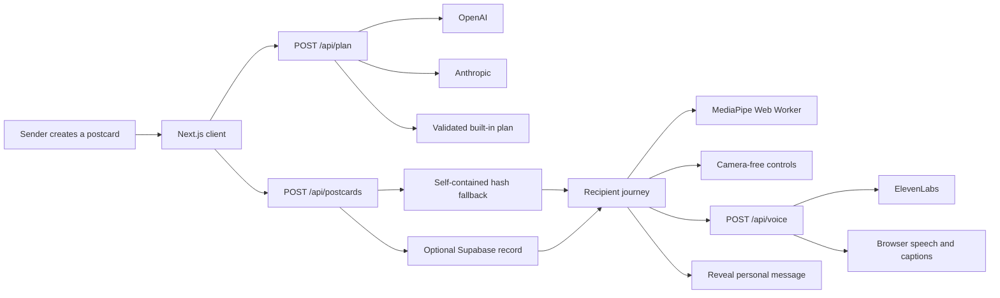

# MoveMail

**A personal message that can only be opened by moving.**

[](https://movemail-blush.vercel.app)


MoveMail turns a family message into a three-move, seated digital postcard. The
recipient completes a short sequence of gentle upper-body movements to reveal
the message. The product deliberately tests one small idea: emotional connection
may make a brief movement break feel worth doing.

MoveMail is a prototype, not a medical device. It does not diagnose, prescribe,
measure health or claim to prevent falls.

## Table of contents

- [Features](#features)
- [Technology](#technology)
- [Architecture overview](#architecture-overview)
- [Installation](#installation)
- [Usage](#usage)
- [Configuration](#configuration)
- [Demo and media](#demo-and-media)
- [API reference](#api-reference)
- [Tests](#tests)
- [Roadmap](#roadmap)
- [Contributing](#contributing)
- [Licence](#licence)
- [Contact](#contact)

## Features

- Converts one personal message into exactly three distinct movements from a
  fixed five-movement vocabulary.
- Uses OpenAI first and Anthropic second in `auto` mode; a validated built-in
  story keeps the complete journey working when neither service is available.
- Runs MediaPipe pose estimation locally in a Web Worker. Camera frames, video
  and pose landmarks are not sent to MoveMail's server.
- Provides camera-free on-screen controls and keyboard input throughout the
  movement sequence.
- Uses ElevenLabs narration when configured, then falls back to browser speech
  synthesis and visible captions.
- Stores postcards in Supabase when configured while retaining a self-contained
  hash link as an outage fallback.
- Includes three visual themes: seaside, garden and dance.
- Uses seated, upper-body movements and clear stop-if-uncomfortable guidance.
- Rejects unrecognised movement IDs, repeated moves, unexpected model fields and
  generated medical claims.
- Continues in an explicit demo mode through sponsor outages and timeouts.

## Technology

| Area | Implementation |
| --- | --- |
| Application | Next.js 16, React 19, TypeScript |
| Local/Sites-compatible build | Vinext, Vite, Cloudflare Worker runtime |
| Camera movement input | MediaPipe Pose Landmarker in a browser Web Worker |
| Story generation | OpenAI Responses API or Anthropic Messages API |
| Narration | ElevenLabs text-to-speech with browser speech fallback |
| Optional persistence | Supabase REST API and PostgreSQL |
| Current hosted demo | Vercel |
| Verification | Node test runner, ESLint, TypeScript, Vinext and Next builds |

## Architecture overview



The fixed movement library is authoritative. An LLM may select and theme three
movement IDs, but it cannot invent a movement mechanic. A shared validator
checks every live or fallback plan before it reaches the player.

Postcard links are bearer links: anybody who receives a link may open it. The
self-contained data is placed after `#card=`, which browsers do not send in HTTP
requests. It is encoded, not encrypted, so the interface tells senders not to
include medical or highly private information.

See [the detailed architecture](docs/ARCHITECTURE.md) and
[the technical audit](docs/reports/TECHNICAL_AUDIT.md).

## Installation

Requirements:

- Node.js 22.13 or newer
- npm
- A modern browser
- A webcam only if camera play is required

```bash
git clone git@github.com:MasteraSnackin/MoveMail.git
cd MoveMail
npm install
cp .env.example .env.local
npm run dev
```

Open [http://localhost:3000](http://localhost:3000). All service credentials are
optional; an empty `.env.local` runs the complete built-in demo path.

For a production-style local run:

```bash
npm run build
npm start
```

## Usage

1. Enter the recipient, sender and a short personal message.
2. Choose a theme and create the movement postcard.
3. Copy the generated bearer link and send it to the recipient.
4. Open the link on a device with enough room for comfortable seated movement.
5. Choose camera play, or continue with the camera-free controls.
6. Complete the three movements to reveal the message.

For the two-minute hackathon demo, use camera-free mode if room, lighting,
permission or model loading is uncertain. This is a supported product path, not
a hidden developer bypass.

## Configuration

Copy `.env.example` to `.env.local` and set only the services you intend to use.

| Variable | Purpose | Default or fallback |
| --- | --- | --- |
| `NEXT_PUBLIC_SITE_URL` | Canonical public URL | Vercel URL or localhost |
| `LLM_PROVIDER` | `auto`, `openai` or `anthropic` | `auto` |
| `OPENAI_API_KEY` | OpenAI server credential | Built-in plan |
| `OPENAI_MODEL` | OpenAI model ID | `gpt-5.6-luna` |
| `ANTHROPIC_API_KEY` | Anthropic server credential | Built-in plan |
| `ANTHROPIC_MODEL` | Anthropic model ID | `claude-sonnet-5` |
| `ELEVENLABS_API_KEY` | ElevenLabs server credential | Browser voice/captions |
| `ELEVENLABS_VOICE_ID` | ElevenLabs voice | Repository default |
| `ELEVENLABS_MODEL` | ElevenLabs model | `eleven_flash_v2_5` |
| `SUPABASE_URL` | Supabase project URL | Self-contained hash link |
| `SUPABASE_SERVICE_ROLE_KEY` | Server-only persistence credential | Self-contained hash link |

Never expose the OpenAI, Anthropic, ElevenLabs or Supabase service-role keys to
client code. Apply [the supplied schema](supabase/schema.sql) before enabling
Supabase. The checked-in schema is not evidence that a remote database has
already been migrated.

## Demo and media

- [Open the hosted demo](https://movemail-blush.vercel.app)
- [Read the two-minute demo guidance](docs/reports/BUILD.md)


The image above is social preview artwork, not test evidence. A fresh
desktop-and-mobile screenshot set still needs to be captured after a real-device
visual pass; the automated environment's browser connection policy prevented
that inspection.

## API reference

These are same-origin application routes, not authenticated public APIs.
Cross-site browser requests are rejected, but production deployments still need
platform-level quotas and rate limiting before sponsor keys are exposed to
untrusted traffic.

Every JSON response includes `X-Request-Id` and `Cache-Control: no-store`.
Errors use:

```json
{
  "ok": false,
  "error": {
    "code": "INVALID_REQUEST",
    "message": "A safe explanation.",
    "requestId": "correlation-id"
  }
}
```

### `POST /api/plan`

Request:

```json
{
  "to": "Mum",
  "from": "Alex",
  "message": "Tea in the garden on Sunday?",
  "theme": "garden"
}
```

A successful response contains `provider`, `mode` and a validated `plan`.
`mode` is `live` for a successful provider result and `demo` for the built-in
fallback. Provider failure is therefore a valid degraded success, not a broken
journey.

### `POST /api/postcards`

Accepts the validated client postcard. A successful response contains either a
Supabase UUID with `mode: "supabase"` or `id: null` with
`mode: "encoded-link"`. The client always keeps its embedded fallback.

### `GET /api/postcards?id=<uuid>`

Returns an unexpired persisted postcard. A missing row returns
`POSTCARD_NOT_FOUND`; an unavailable or unconfigured dependency returns
`STORAGE_UNAVAILABLE` so the client can recover from its embedded fallback.

### `POST /api/voice`

Request:

```json
{ "text": "Open your arms comfortably." }
```

Returns ElevenLabs audio when available. Status `204` with
`X-MoveMail-Voice: browser-fallback` tells the client to use browser speech and
captions.

## Tests

Run the complete checked-in suite:

```bash
npm test
npm run lint
npx tsc --noEmit
npx next build
npm audit --omit=dev
```

Verified on 25 July 2026:

- 38 automated tests passed.
- Vinext production build passed.
- Standard Next.js production build passed.
- ESLint passed.
- TypeScript strict checking passed.
- Production dependencies reported zero known vulnerabilities.
- The full development tree reported nine high-severity advisories in the
  ESLint/minimatch/brace-expansion toolchain. The suggested forced update is
  breaking and has not been applied without compatibility evidence.

The remaining highest-value test is a real desktop-and-mobile browser journey
covering camera permission, camera-free fallback and a tampered postcard link.

## Roadmap

- Test the experience with three to five older adults and record recruitment,
  consent, observations and changes; no real-user bonus is currently claimed.
- Add real-device camera performance and accessibility testing.
- Add end-to-end browser coverage for the full two-minute journey.
- Configure Vercel or equivalent platform rate limits and request-size limits.
- Add provider-neutral operational metrics without recording postcard content.
- Add authenticated deletion and a scheduled physical purge for expired
  Supabase records.
- Move the report-only Content Security Policy to enforcement after camera,
  WASM and sponsor paths have been verified.
- Consolidate or continuously verify the Next.js and Vinext build paths.

## Contributing

Open an issue before making a material product, safety or architecture change.
Keep the product boundary narrow, preserve the deterministic demo path, never
log postcard content or secrets, and add tests for changed behaviour.

Before proposing a change, run the commands in [Tests](#tests) and document any
browser or sponsor-service checks that could not be performed.

## Licence

No open-source licence has been selected. Copyright law therefore applies by
default and public reuse is not granted. Add an explicit `LICENSE` file before
presenting the repository as open source.

## Contact

Use [GitHub Issues](https://github.com/MasteraSnackin/MoveMail/issues) for
reproducible defects, accessibility findings and scoped product proposals.
