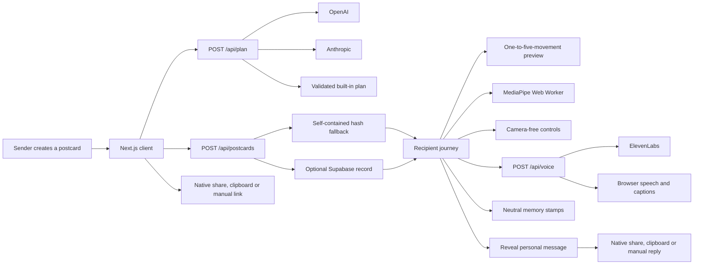
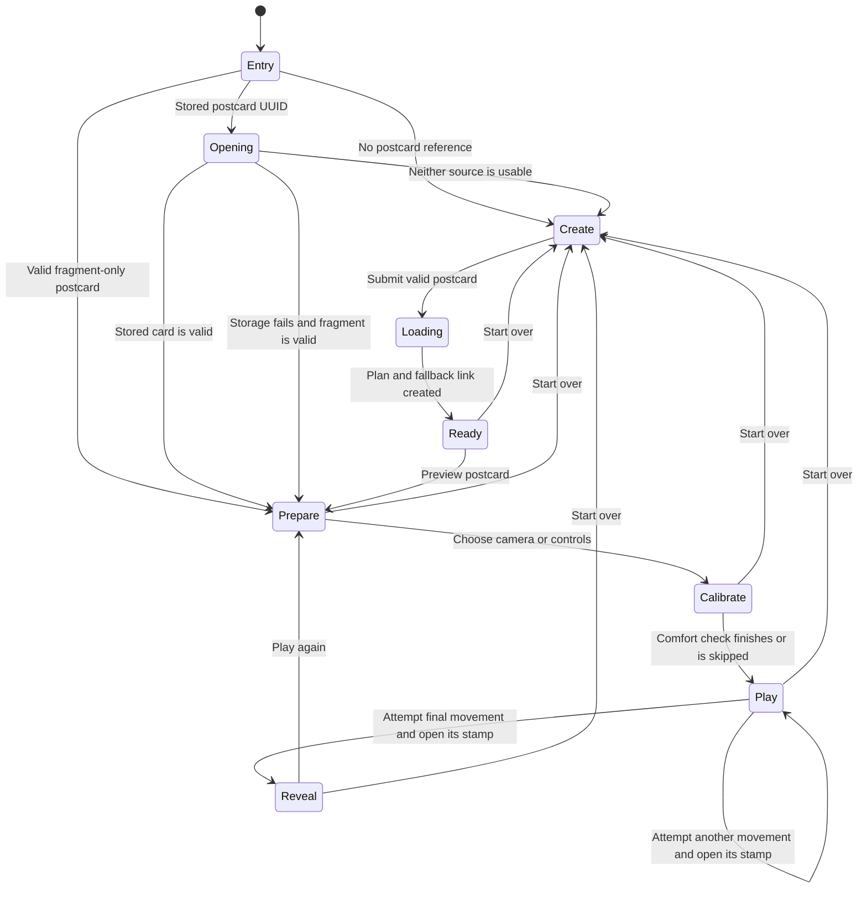
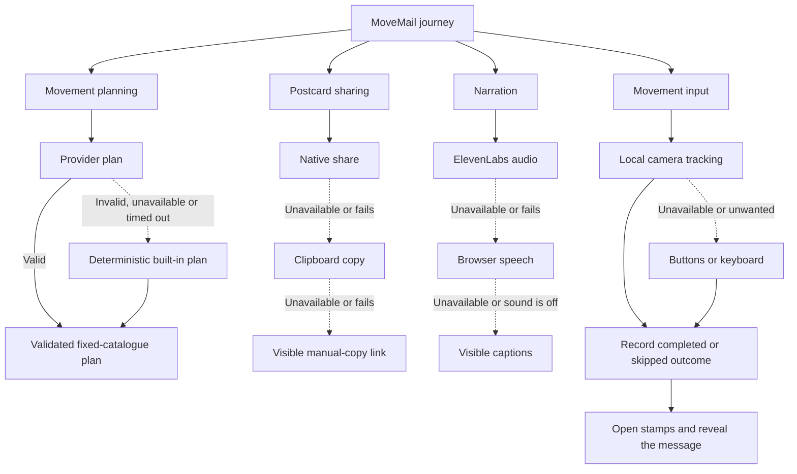
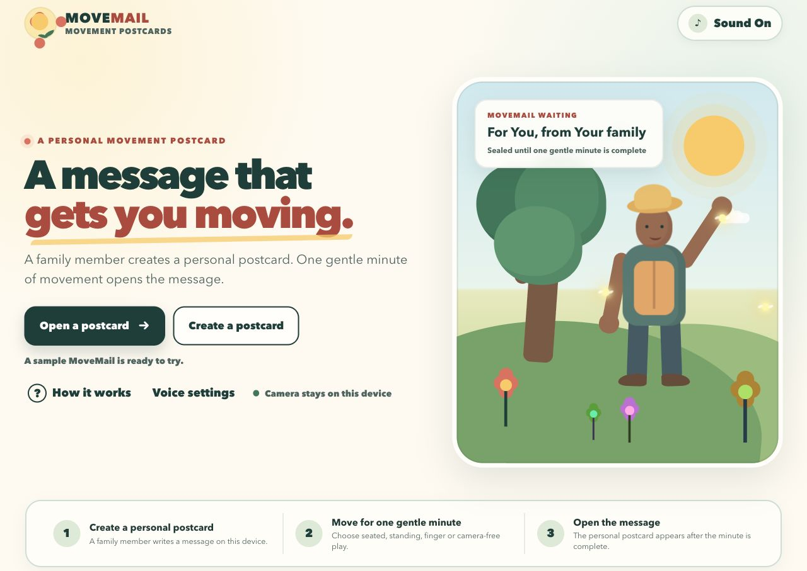
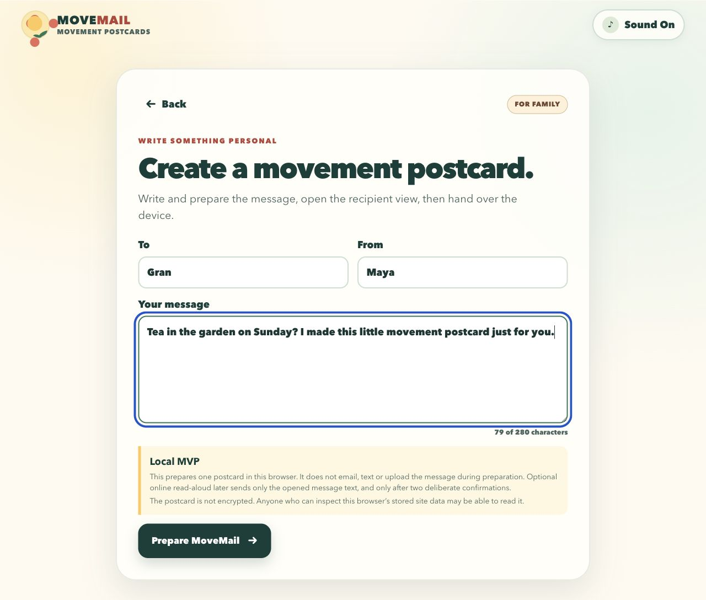
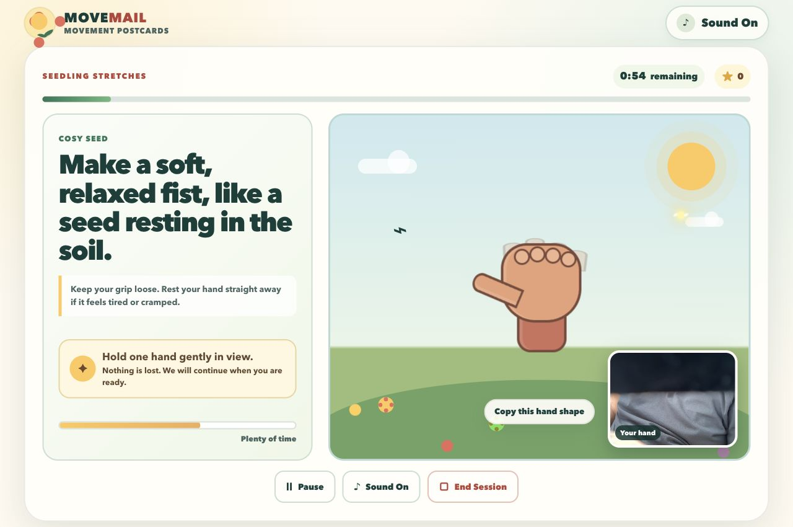
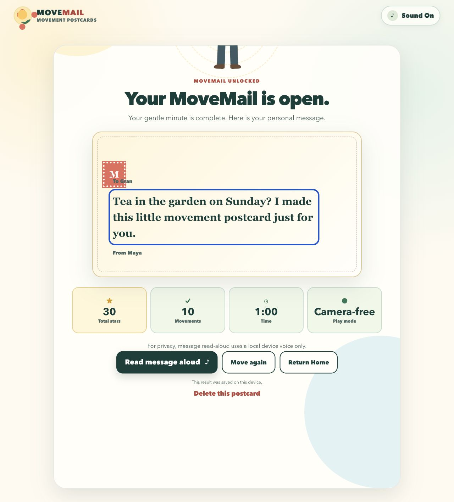

# MoveMail

**A personal message that can only be opened by moving.**

[](https://movemail-blush.vercel.app)


MoveMail turns a family message into a short, seated digital postcard. The
sender chooses one to five movements and which reviewed movement mechanics may
appear. The recipient attempts that gentle upper-body sequence to reveal the
message, with an explicit skip for an uncomfortable step. The product
deliberately tests one small idea: emotional connection may make a brief
movement break feel worth doing.

MoveMail is a prototype, not a medical device. It does not diagnose, prescribe,
measure health or claim to prevent falls.

## Table of contents

- [Features](#features)
- [Technology](#technology)
- [Architecture overview](#architecture-overview)
- [Installation](#installation)
- [Usage](#usage)
- [Configuration](#configuration)
- [Demo and media](#demo-and-media)
- [API reference](#api-reference)
- [Tests](#tests)
- [Roadmap](#roadmap)
- [Contributing](#contributing)
- [Licence](#licence)
- [Contact](#contact)

## Features

- Lets the sender request one to five distinct movements and choose the
  available pool from a fixed nine-movement vocabulary: side reaches, open
  arms, hands together, a gentle wave, a two-hand lift, a cross-body reach, a
  self-hug and two soft claps. Three movements with all nine available remains
  the recommended default.
- Uses OpenAI first and Anthropic second in `auto` mode; a validated built-in
  story keeps the complete journey working when neither service is available.
- Offers optional session-only OpenAI, Claude and ElevenLabs key settings.
  Keys stay in page memory, work only over HTTPS or localhost, and each request
  carries at most the one key needed by its named provider. The browser checks
  the page origin before sending a key and the plan and voice routes independently
  reject a marked personal key on non-loopback plain HTTP.
- Never writes a session key into a postcard, link, browser store or Supabase.
  Supabase service-role and deployment credentials remain server-only.
- Runs MediaPipe pose estimation locally in a Web Worker. Camera frames, video
  and pose landmarks are not sent to MoveMail's server.
- Selects MediaPipe's classic or module WASM loader to match the actual Worker
  runtime. Development and both production builds synchronise all six required
  classic, module and no-SIMD assets from the installed package.
- Waits for a real first camera frame, detects a stalled stream and bounds
  repeated capture or Worker errors. Failure moves to the labelled camera-free
  path with the specific reason and a visible camera retry.
- Tracks left- and right-hand wave evidence independently, requires both arms
  for the open-arms movement, and uses a near-shoulder two-hand-lift target of
  0.1 shoulder widths.
- Pauses movement holds when pose data is missing or when observations are more
  than 500 ms apart, so unobserved time cannot finish a move.
- Uses calm qualitative coaching rather than exposing camera-confidence or
  movement-score percentages.
- Provides camera-free on-screen controls and keyboard input throughout the
  movement sequence.
- Shows the complete selected plan before play. **Hear the movement** or
  **Hear all N** sends one bounded movement-only narration request per
  activation; the personal postcard message is not part of that request.
- Lets a recipient visibly skip a movement that is not comfortable. Completed
  and skipped steps are recorded separately, and either is an honest attempted
  outcome on the route to the message.
- Opens one deterministic theme-and-movement memory stamp after each attempted
  step. A skipped step opens its postcard piece without being described as
  completed or earned.
- Uses ElevenLabs narration when configured, then falls back to browser speech
  synthesis and visible captions.
- Never narrates the revealed personal message automatically. The recipient must
  choose **Read it aloud**; the creation form discloses that this explicit action
  may send the message to ElevenLabs.
- Lets the sender share a prepared invitation and bearer link through the
  device share sheet when available, then falls back to the clipboard or a
  selected link for manual copying. The invitation excludes the personal note;
  names are whitespace-normalised and Unicode-safely capped, and the URL must be
  a valid HTTP or HTTPS address.
- Offers an outcome-neutral reply after reveal through the same
  share/clipboard/manual sequence. It is never sent or stored automatically and
  contains neither the personal note nor movement results.
- Stores postcards in Supabase when configured while retaining a self-contained
  hash link as an outage fallback.
- Uses `lib/postcards/contract.ts` as the shared owner of postcard contract
  version 1, themes, field/count limits and core types. Stored and fragment
  boundaries still validate untrusted data independently; storage records
  provenance as unverified and replaces client-supplied movement labels and cues
  with server-owned copy. The postcard API requires the shared `version` field:
  version 1 is accepted and unsupported versions are rejected rather than
  silently written as version 1.
- Gives the creating browser a one-time deletion token for an optional Supabase
  copy; the supplied schema also schedules hourly deletion of expired rows.
- Includes three visual themes: seaside, garden and dance.
- Uses seated, upper-body movements and clear stop-if-uncomfortable guidance.
- Keeps the on-device camera statement visible on the create screen, including a
  compact **Camera stays on this device** note on narrow mobile layouts.
- Uses theme-responsive postcard decoration: paper grain, postmarks, loading
  vignettes, an embossed seal, themed game landscapes and opened memory stamps.
  Decorative layers never intercept input and the larger marks are hidden on
  narrow screens.
- Rejects unrecognised movement IDs, repeated moves, unexpected model fields and
  generated medical claims.
- Gives an explicit seaside, garden or dance choice precedence in deterministic
  planning; message-based fallback matching uses whole words rather than
  accidental substrings.
- Rejects oversized request bodies before JSON parsing and applies a small
  per-runtime, per-route token bucket before paid provider or storage work.
- Protects deployment-configured OpenAI and Anthropic calls with isolated
  per-provider circuit breakers: three consecutive failures open a 30-second
  circuit, then one half-open probe may restore service. Personal session keys
  bypass shared circuit state.
- Emits versioned, timed `movemail.dependency` diagnostics using only request ID,
  provider, operation, category, status and duration. Postcard text, names,
  credentials, audio and camera data are excluded. The event builder reconstructs
  that fixed shape and replaces invalid caller-controlled request IDs, categories
  and statuses instead of logging arbitrary values.
- Continues in an explicit demo mode through sponsor outages and timeouts.

## Technology

| Area | Implementation |
| --- | --- |
| Application | Next.js 16, React 19, TypeScript |
| Local/Sites-compatible build | Vinext, Vite, Cloudflare Worker runtime |
| Camera movement input | MediaPipe Pose Landmarker in a browser Web Worker |
| Story generation | OpenAI Responses API or Anthropic Messages API |
| Narration | ElevenLabs text-to-speech with browser speech fallback |
| Optional persistence | Supabase REST API and PostgreSQL |
| Current hosted demo | Vercel |
| Verification | Node test runner, Playwright Chromium, ESLint, TypeScript, Vinext and Next builds |

## Architecture overview

The complete technical design is documented in
[docs/ARCHITECTURE.md](docs/ARCHITECTURE.md), including C1–C4 views, Level 0
and Level 1 data-flow diagrams, creation and recipient sequences, the client
state machine, AI safety pipeline, resilience map and deployment topology.



The selected diagrams below condense its behavioural and resilience views.

### Postcard journey



### Graceful fallback paths



The fixed movement library is authoritative. `lib/postcards/contract.ts` owns
the version, themes, shared display limits and core postcard shapes used by the
client, fragment and storage paths. Each external boundary retains its own
runtime validation. An LLM may select and theme the
requested number of movement IDs only from the sender's allowed pool, but it
cannot invent a movement mechanic. A shared validator checks the requested
count, allowed pool and every live or fallback plan before it reaches the
player. Optional stored postcards are checked again: unsafe or medical framing
is rejected and physical labels and cues are regenerated from server-owned
copy.

When the final plan contains a left reach, right reach or open-arms movement,
the comfort check samples only the selected direction or arm action and adapts
that target to the observed range. Plans without those movements skip the reach
step. Wave, lift, hands-together, cross-body, self-hug and double-clap matching
use conservative product settings or movement evidence; they are not claimed
to be individually calibrated or clinically validated.

Postcard links are bearer links: anybody who receives a link may open it. The
self-contained data is placed after `#card=`, which browsers do not send in HTTP
requests. It is encoded, not encrypted, so the interface tells senders not to
include medical or highly private information.

See also [the technical audit](docs/reports/TECHNICAL_AUDIT.md).

## Installation

Requirements:

- Node.js 22.13 or newer
- npm
- A modern browser
- A webcam only if camera play is required

```bash
git clone git@github.com:MasteraSnackin/MoveMail.git
cd MoveMail
npm install
cp .env.example .env.local
npm run dev
```

Open [http://localhost:3000](http://localhost:3000). All service credentials are
optional; an empty `.env.local` runs the complete built-in demo path.

For a production-style local run:

```bash
npm run build
npm start
```

## Usage

Optional: open **Service settings** in the header to choose OpenAI, Claude,
automatic provider selection or the built-in story, and to add personal
OpenAI, Anthropic or ElevenLabs test keys for the current page only. Personal
keys are accepted only on HTTPS or localhost. Refreshing or closing the page
clears them; **Clear my keys** stops the app using them immediately.

1. Enter the recipient, sender and a short personal message.
2. Choose a theme, select one to five movements and optionally narrow the
   checked pool of movement mechanics. The pool must contain at least as many
   movements as the requested count.
3. Create the movement postcard.
4. Select **Share postcard** to open the device share sheet with a prepared
   invitation and link. If native sharing is unavailable, MoveMail copies the
   invitation and link or selects the link for manual copying.
5. Open the link on a device with enough room for comfortable seated movement.
6. Review every visible movement. **Hear the movement** for a one-move plan or
   **Hear all N** for a longer plan narrates only those labels and cues in one
   bounded request; it does not narrate the personal note.
7. Choose camera play, or continue with the camera-free controls.
8. Complete each movement, or use the visible skip when a movement is not
   comfortable. Each attempted step opens its deterministic memory stamp; a
   skipped step is not called completed or earned.
9. After the final attempt, read the message and optionally share the
   outcome-neutral reply. MoveMail does not automatically send or store the
   reply, and it excludes the message and movement results. The personal message
   is never narrated automatically; **Read it aloud** is an explicit recipient
   action and may send that message to ElevenLabs when configured.

For the two-minute hackathon demo, use camera-free mode if room, lighting,
permission or model loading is uncertain. This is a supported product path, not
a hidden developer bypass. Point to **Share postcard** and **Share this reply**
without opening the operating-system share sheets. Keep the recommended
three-movement Brighton plan for the judged run and use **Hear all 3** only if
the remaining time allows it.

## Configuration

### Session-only personal keys

**Service settings** accepts optional personal OpenAI, Claude (Anthropic) and
ElevenLabs keys. Use restricted, low-spend test keys only.

- Keys live only in React/page memory. MoveMail does not use `localStorage`,
  `sessionStorage` or IndexedDB for them.
- A non-local page must use HTTPS. Local development may use `http://localhost`,
  `127.0.0.1` or the IPv6 loopback address.
- A story request carries at most one provider-scoped key. In automatic mode,
  OpenAI and Claude are attempted as separate requests, so neither provider
  receives the other's key. The ElevenLabs key is sent only with a voice
  request.
- The browser sends the selected key in an `Authorization` header to the
  same-origin MoveMail route. The plan and voice routes validate the marked
  header, independently require HTTPS or a local HTTP loopback origin for a
  personal key, and forward it only to the matching sponsor service. They do not
  echo the key in the response or include it in request bodies.
- Keys are not placed in postcard data, share links, optional Supabase records
  or family-share text. A recipient does not inherit a sender's session key
  through a postcard link.
- Missing, rejected or unavailable credentials still lead to the validated
  built-in story, browser speech and visible instructions.

This memory-only design avoids deliberate persistence; it is not protection
against a compromised page, browser extension, device or hosting origin.

### Deployment environment

Copy `.env.example` to `.env.local` and set only the server services you intend
to use.

| Variable | Purpose | Default or fallback |
| --- | --- | --- |
| `NEXT_PUBLIC_SITE_URL` | Canonical public URL | Vercel URL or localhost |
| `LLM_PROVIDER` | `auto`, `openai` or `anthropic` | `auto` |
| `OPENAI_API_KEY` | OpenAI server credential | Built-in plan |
| `OPENAI_MODEL` | OpenAI model ID | `gpt-5.6-luna` |
| `ANTHROPIC_API_KEY` | Anthropic server credential | Built-in plan |
| `ANTHROPIC_MODEL` | Anthropic model ID | `claude-sonnet-5` |
| `ELEVENLABS_API_KEY` | ElevenLabs server credential | Browser voice/captions |
| `ELEVENLABS_VOICE_ID` | ElevenLabs voice | Repository default |
| `ELEVENLABS_MODEL` | ElevenLabs model | `eleven_flash_v2_5` |
| `SUPABASE_URL` | Supabase project URL | Self-contained hash link |
| `SUPABASE_SERVICE_ROLE_KEY` | Server-only persistence credential | Self-contained hash link |

Deployment-wide OpenAI, Anthropic and ElevenLabs credentials belong in server
environment variables, not client code. Supabase service-role keys and hosting
or deployment tokens are never accepted by **Service settings** and must remain
server-only. Apply [the supplied schema](supabase/schema.sql) before enabling
Supabase. The checked-in schema is not evidence that a remote database has
already been migrated.

## Demo and media

- [Open the hosted demo](https://movemail-blush.vercel.app)
- [Run the word-for-word two-minute demo](docs/DEMO_SCRIPT.md)
- [Keep the two-minute presenter cue card open](docs/DEMO_CUE_CARD.md)
- [Read the judge setup, credential and evidence handoff](docs/JUDGES.md)
- [Read the build and fallback guidance](docs/reports/BUILD.md)
- [View the social preview artwork](public/og.png)



The image above is a real local desktop capture of the MoveMail landing screen.
It shows the family-message concept, sealed movement postcard, primary actions
and on-device camera statement.

### Product walkthrough

**1. Create a personal movement postcard**



A family member prepares the postcard locally, with clear storage and
read-aloud privacy guidance before handing over the device.

**2. Play with finger and hand tracking**



Finger Play tracks gentle hand shapes locally in the browser. The active game
keeps the live preview small, labels it clearly and provides pause and end
controls throughout the minute.

**3. Complete the minute and open the message**



After the supported camera-free minute, the postcard opens with the personal
message and a simple summary of time, movements and play mode.

Six deterministic Chromium journeys exercise fragment opening and reveal,
stored-to-fragment fallback, focus and Space completion, session-key
memory/clear/insecure-origin behaviour, narration cancellation and denied-camera
recovery. A physical-device camera run and operating-system share-sheet check
are still required.

## API reference

These are same-origin application routes, not authenticated public APIs.
Cross-site browser requests are rejected. Pre-parse byte limits and small
per-runtime token buckets provide an application-level backstop, but a public
deployment still needs durable platform/WAF quotas because serverless instances
do not share these in-memory buckets.

Every JSON response includes `X-Request-Id` and `Cache-Control: no-store`.
Errors use:

```json
{
  "ok": false,
  "error": {
    "code": "INVALID_REQUEST",
    "message": "A safe explanation.",
    "requestId": "correlation-id"
  }
}
```

The routes may also return `413 PAYLOAD_TOO_LARGE` or `429 RATE_LIMITED`.
Rate-limited responses include `Retry-After`.

### `POST /api/plan`

Request:

```json
{
  "to": "Mum",
  "from": "Alex",
  "message": "Tea in the garden on Sunday?",
  "theme": "garden",
  "moveCount": 3,
  "allowedMovementIds": [
    "gentle_wave",
    "reach_left",
    "open_arms",
    "hands_together"
  ]
}
```

A successful response contains `provider`, `mode` and a validated `plan`.
`mode` is `live` for a successful provider result and `demo` for the built-in
fallback. Provider failure is therefore a valid degraded success, not a broken
journey. `moveCount` accepts a whole number from 1 to 5.
`allowedMovementIds` must contain distinct supported IDs and at least
`moveCount` entries. Omitting both fields preserves the three-movement,
all-nine default for older clients.

### `POST /api/postcards`

Accepts the validated client postcard with required `version: 1`. Missing or
unsupported versions are rejected; the route never silently restamps them.
The route validates the visible framing, requires one to five distinct
allow-listed IDs, and replaces supplied movement labels/cues with reviewed
server-owned copy. A successful response contains
either a Supabase UUID with `mode: "supabase"` or `id: null` with
`mode: "encoded-link"`. The client always keeps its embedded fallback. A stored
response also returns a one-time `deletionToken`; only its SHA-256 digest is
stored.

### `GET /api/postcards?id=<uuid>`

Returns an unexpired persisted postcard. A missing row returns
`POSTCARD_NOT_FOUND`; an unavailable or unconfigured dependency returns
`STORAGE_UNAVAILABLE` so the client can recover from its embedded fallback.
Stored provenance is explicitly `unverified`, and the client presents the
physical sequence through its fixed demo vocabulary.

### `DELETE /api/postcards?id=<uuid>`

Deletes the optional Supabase copy when sent with
`Authorization: Bearer <deletionToken>`. The creating browser keeps this token
only in the current page session and offers the action on the ready screen.
Deleting the database row does not revoke the self-contained fragment copy
already included in a shared URL.

### `POST /api/voice`

Request:

```json
{ "text": "Open your arms comfortably." }
```

Returns ElevenLabs audio when available. Status `204` with
`X-MoveMail-Voice: browser-fallback` tells the client to use browser speech and
captions. The pre-game hear-all action composes the complete one-to-five-item
reviewed movement plan into one request bounded by the same 450-character
limit; it does not include the postcard message.

## Tests

Run the release-equivalent local verification:

```bash
npm run verify
```

Individual commands are available as `npm run lint`, `npm run typecheck`,
`npm test`, `npm run test:browser`, `npm run build:next` and
`npm run audit:prod`. A matching
`.github/workflows/verify.yml` is prepared locally, but it is currently
untracked and has no remote GitHub Actions run evidence.

The release checks cover:

- 168 Node tests and six deterministic Chromium journeys.
- Vinext production build passed.
- Standard Next.js production build passed.
- ESLint passed.
- TypeScript strict checking passed.
- Production dependencies reported zero known vulnerabilities.
- Contract tests for the one-to-five count, allowed movement pool and
  deterministic fallback, plus all-nine-movement matching, request-limit,
  deletion, fragment migration, keyboard-intent and design-system regressions.
- Pure tests also cover deterministic memory-stamp labels, bounded
  one-to-five-movement preview narration, message-excluding invitation/reply copy and
  native-share-to-clipboard-to-manual delivery order.
- Credential tests cover page-origin gating, key validation, one-provider
  request isolation, route parsing, server-side HTTPS/loopback enforcement,
  non-echo behaviour and the absence of browser persistence or postcard-route
  credentials.
- Camera regressions cover real-frame readiness, stalled streams, classic/module
  Worker-loader selection and exact local module-asset parity. Contract tests
  prove fragment and stored paths share version 1 and the same theme set.
- Dependency-diagnostic tests enforce a versioned, content-free event shape and
  finite non-negative durations, and prove arbitrary caller-controlled
  identifiers, categories and statuses are replaced. Design guards keep the
  mobile on-device camera note present at the narrow breakpoint.
- Provider-circuit tests cover the three-failure threshold, 30-second cooldown,
  single half-open probe, provider isolation, failover diagnostics and
  personal-key bypass.
- Playwright runs six deterministic Chromium journeys: fragment-only reveal,
  stored-link failure with embedded fallback, focus transfer and Space
  completion, personal-key memory/clear/insecure-origin handling, cancellation
  of an in-flight narration request, and denied-camera recovery controls.
- The full development tree reported nine high-severity advisories in the
  ESLint/minimatch/brace-expansion toolchain. The suggested forced update is
  breaking and has not been applied without compatibility evidence.

The remaining highest-value evidence is on representative physical devices:
real MediaPipe camera inference and performance, operating-system native sharing,
clipboard permission states, responsive visual review, assistive technology,
live providers and report-only CSP behaviour.

## Roadmap

Status and closure evidence are tracked in the
[MoveMail action register](docs/ACTION_REGISTER.md).

- Test the experience with three to five older adults and record recruitment,
  consent, observations and changes; no real-user bonus is currently claimed.
- Add real-device camera performance and accessibility testing.
- Extend browser coverage to native-sharing and clipboard-permission behaviour
  where representative devices can expose the real operating-system surfaces.
- Configure Vercel or equivalent platform/WAF rate limits and cost quotas; the
  application-level per-runtime limiter is not a distributed production control.
- Connect the implemented privacy-safe timed dependency events to an approved
  metrics backend, retention policy, dashboards and alerts.
- Apply and verify the supplied Supabase migration, deletion-token flow and
  hourly purge job on the intended live project.
- Add signed plan receipts or sender authentication if trusted provenance or
  revocation is required.
- Move the report-only Content Security Policy to enforcement after camera,
  WASM and sponsor paths have been verified.
- Commit and push the prepared dual-build GitHub Actions workflow, observe a
  successful remote run and make that check required for release.

## Contributing

Open an issue before making a material product, safety or architecture change.
Keep the product boundary narrow, preserve the deterministic demo path, never
log postcard content or secrets, and add tests for changed behaviour.

Before proposing a change, run the commands in [Tests](#tests) and document any
browser or sponsor-service checks that could not be performed.

## Licence

No open-source licence has been selected. Copyright law therefore applies by
default and public reuse is not granted. Add an explicit `LICENSE` file before
presenting the repository as open source.

## Contact

Use [GitHub Issues](https://github.com/MasteraSnackin/MoveMail/issues) for
reproducible defects, accessibility findings and scoped product proposals.
