# System Architecture: MoveMail

## Overview

MoveMail is a full-stack web prototype that turns a personal message into a
short movement postcard. A sender writes a note, chooses a theme, requests one
to five movements and selects which of the nine reviewed movement mechanics may
appear. The server asks one configured language model to select the requested
number only from that allowed pool and to supply limited story copy. A
recipient attempts the sequence with local camera tracking or camera-free
on-screen controls before the note is revealed; an uncomfortable step may be
explicitly skipped and remains distinct from a completed movement. Before
play, the recipient can inspect the complete sequence or hear one bounded
movement-only narration. Each attempted step opens a deterministic themed
memory stamp, and the reveal offers an outcome-neutral reply that is neither
sent nor stored automatically.

The product deliberately has a narrow wellbeing boundary. It does not diagnose, prescribe, measure health, verify physical ability or claim a medical outcome. The movement matcher provides game progress, not a clinical score.

The complete journey works without sponsor credentials. OpenAI or Anthropic can
plan the sequence, ElevenLabs can narrate it and Supabase can persist it, but
deterministic story generation, browser speech, a URL-fragment postcard and
on-screen controls are always available as fallbacks. A user may optionally add
personal OpenAI, Claude and ElevenLabs keys for the current page. Those keys
stay in browser memory, are accepted only on HTTPS or localhost, and transit
the MoveMail server only in a marked request to the matching sponsor. The
browser checks this origin boundary before sending; the plan and voice routes
independently reject marked personal keys on non-loopback plain HTTP.

`lib/postcards/contract.ts` is the shared version-1 postcard contract. It owns
the three themes, common field and movement-count limits, and the core client
and storage shapes. Fragment decoding, the client and the postcard API still
perform independent runtime validation at their respective trust boundaries.
The postcard API requires the shared `version` field and rejects unsupported
versions instead of rewriting them as version 1.

## Key Requirements

- Let the sender request one to five distinct movements and choose the allowed
  subset of `reach_left`, `reach_right`, `open_arms`, `hands_together`,
  `gentle_wave`, `lift_both_hands`, `cross_body_reach`, `self_hug` and
  `gentle_double_clap`; the pool must contain at least the requested count.
- Keep movement labels and physical instructions within fixed, reviewed
  product-owned copy; stored records regenerate that copy on the server.
- Treat model output and shared-link content as untrusted input.
- Keep camera frames and pose inference on the user's device.
- Match MediaPipe's classic or module WASM loader to the actual Worker runtime,
  keep both loader asset sets reproducible, and bound first-frame and stalled
  camera states.
- Support a camera-free journey with equivalent access to the message.
- Adapt only side-reach and open-arms targets from the comfort check; do not
  represent every movement as individually calibrated.
- Offer a visible movement skip and distinguish completed from skipped outcomes.
- Preview the complete selected sequence before play and keep the optional combined
  narration within the voice limit without including the personal message.
- Open a deterministic theme-and-movement stamp for every attempted step while
  avoiding completed, earned or score language for skipped steps.
- Prefer native family sharing, with clipboard and visible manual-copy
  fallbacks for both the sender invitation and recipient reply.
- Keep invitation copy free of the personal note, and keep the default recipient
  reply free of both the note and movement outcomes.
- Remain demonstrable when every optional external service is unconfigured or unavailable.
- Bound provider waits so the main journey cannot stall indefinitely.
- Avoid medical claims and tell users to stop if movement is painful, dizzying or uncomfortable.
- Protect server-side credentials from the browser.
- Keep optional personal sponsor keys in current-page memory only; never write
  them to browser storage, postcards, links or Supabase.
- Send at most one personal provider key in a request, require the matching
  provider marker, and do not confuse unrelated site `Authorization` headers
  with sponsor credentials.
- Accept personal keys only on HTTPS or local HTTP loopback origins. Keep
  this check in both the browser and the receiving plan/voice routes. Keep
  Supabase service-role, hosting and deployment-wide credentials server-only.
- Make privacy limitations visible: postcards are bearer links, not encrypted
  or access-controlled messages.
- Emit dependency diagnostics through a versioned content-free allow-list with
  finite operation duration rather than postcard or credential data.

## Diagram Catalogue

The diagrams use standard Mermaid flowcharts rather than Mermaid's experimental
C4 macros so they render more consistently in GitHub. C1–C4 are successive zoom
levels: system context, containers, components and code.

| View | Question answered |
| --- | --- |
| C1 system context | Who uses MoveMail and which external systems can it call? |
| C2 containers | Which deployable/runtime parts exist and where does code execute? |
| C3 components | How are browser features, family sharing and server responsibilities divided? |
| C4 code | How does local camera input become qualitative feedback, an attempted outcome and a neutral memory stamp? |
| DFD Level 0 | What data crosses the whole-system boundary? |
| DFD Level 1 | Which processes and stores handle each data class? |
| Sequence: create and share | What happens from sender input to a resilient bearer link? |
| Sequence: open, play and reveal | What happens from link opening through preview, play, reveal and optional reply? |
| State machine | Which user-interface states and recovery transitions exist? |
| AI safety pipeline | Where are model input, output and fallbacks constrained? |
| Graceful-degradation map | What replaces each optional service when it fails? |
| Deployment topology | How do the alternative Vercel and Vinext release paths differ? |

Diagram convention:

- Solid arrows show normal calls or data movement.
- Dotted arrows show optional integrations, alternative deployments or
  fallback paths.
- A cylinder is a persistent data store.
- An external system is outside the MoveMail codebase; browser-native
  capabilities can still remain on the user's device.

## C4 Model

### C1 — System context

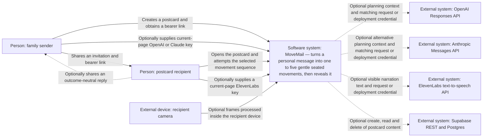

OpenAI and Anthropic are alternatives. In `auto` mode, configured OpenAI is
tried first and configured Anthropic is tried only after failure. Every external
service is optional: deterministic planning, fragment sharing, browser speech
and on-screen controls preserve the complete journey.

### C2 — Container view

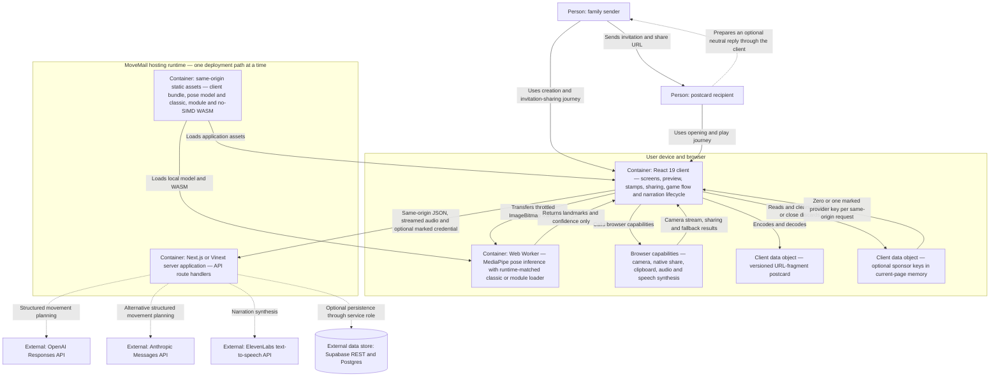

The host is either the Next.js/Vercel path or the
Vinext/Worker-compatible path, not both simultaneously. D1 and R2 bindings are
currently `null`; neither is a MoveMail postcard store. `#card` data stays in
the browser because URL fragments are not included in HTTP requests. Session
keys are not encoded into that fragment, optional Supabase records or browser
storage. A recipient therefore never inherits the sender's key through a link.

### C3A — Browser client components

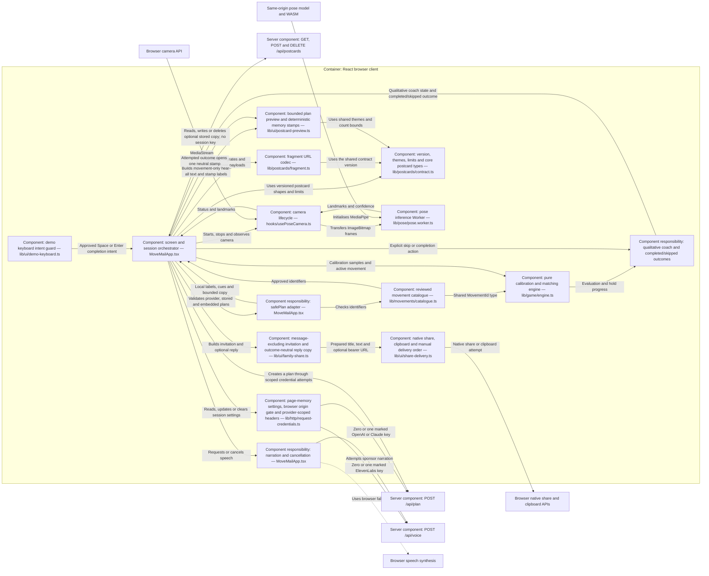

### C3B — Server application components

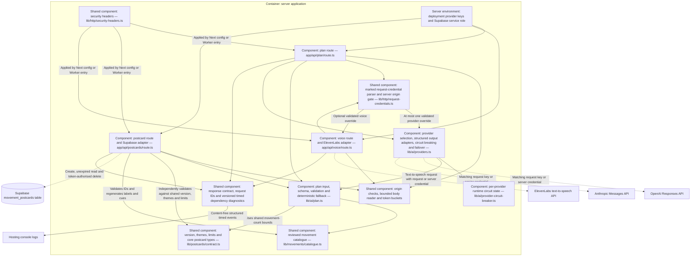

### C4 — Code-level local pose and game pipeline

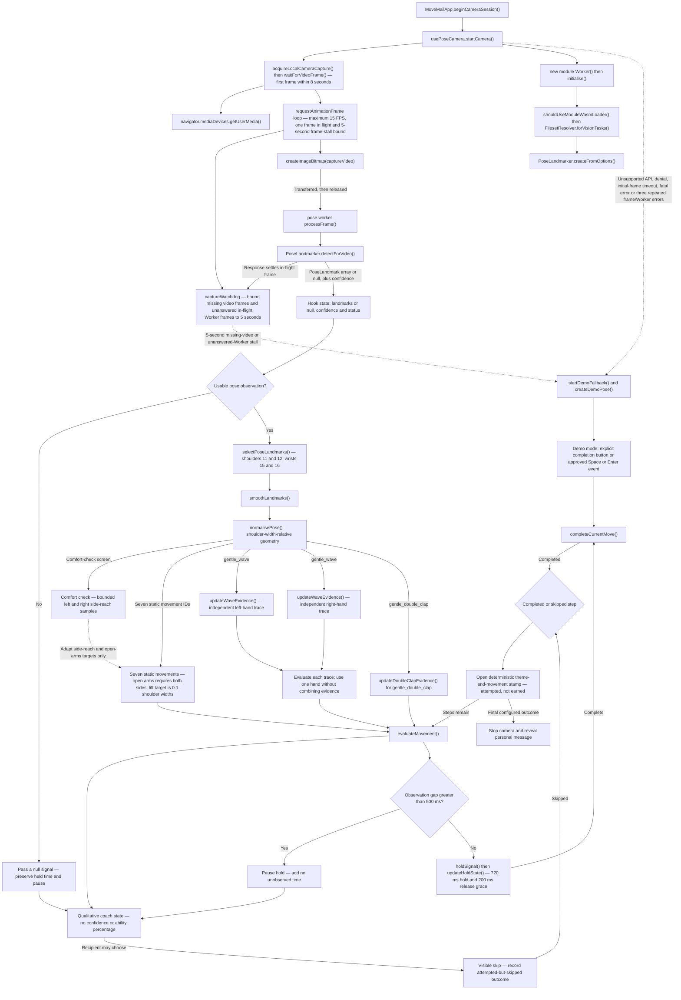

Generated demo-pose landmarks label the fallback state but do not complete
movements automatically. In demo mode, completion requires the explicit button
or an approved keyboard event. In either mode, a visible skip is recorded
separately from completion and advances the attempted step. Both outcomes open
the step's deterministic postcard stamp; the stamp is not an achievement,
completion or fitness score.

The Worker probes whether classic `importScripts()` is usable and passes the
matching loader mode to MediaPipe. `scripts/sync-mediapipe-assets.mjs` copies
classic, module and no-SIMD runtime pairs before development and both production
builds. Camera acquisition does not report ready until the capture video has a
real frame. `lib/pose/captureWatchdog.ts` separately bounds a missing video
frame and a transferred frame that receives no Worker response; either reaches
the recoverable stall boundary after five seconds. A fatal Worker error or
three consecutive capture/Worker errors also releases the camera and enters
the labelled camera-free state; the interface preserves the reason and offers
retry.

## Data-Flow Diagrams

### DFD Level 0 — system context

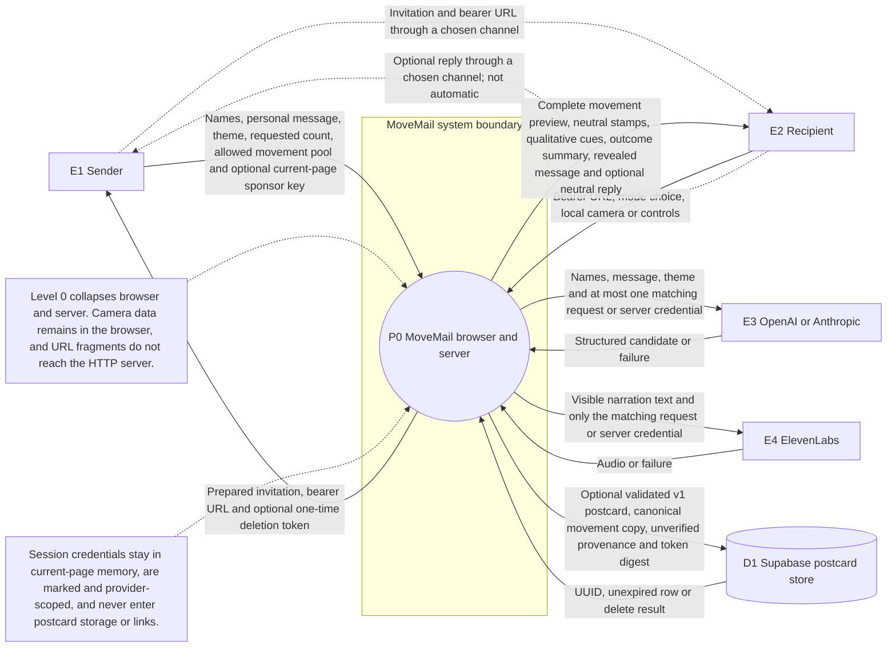

### DFD Level 1 — processes, stores and trust boundaries

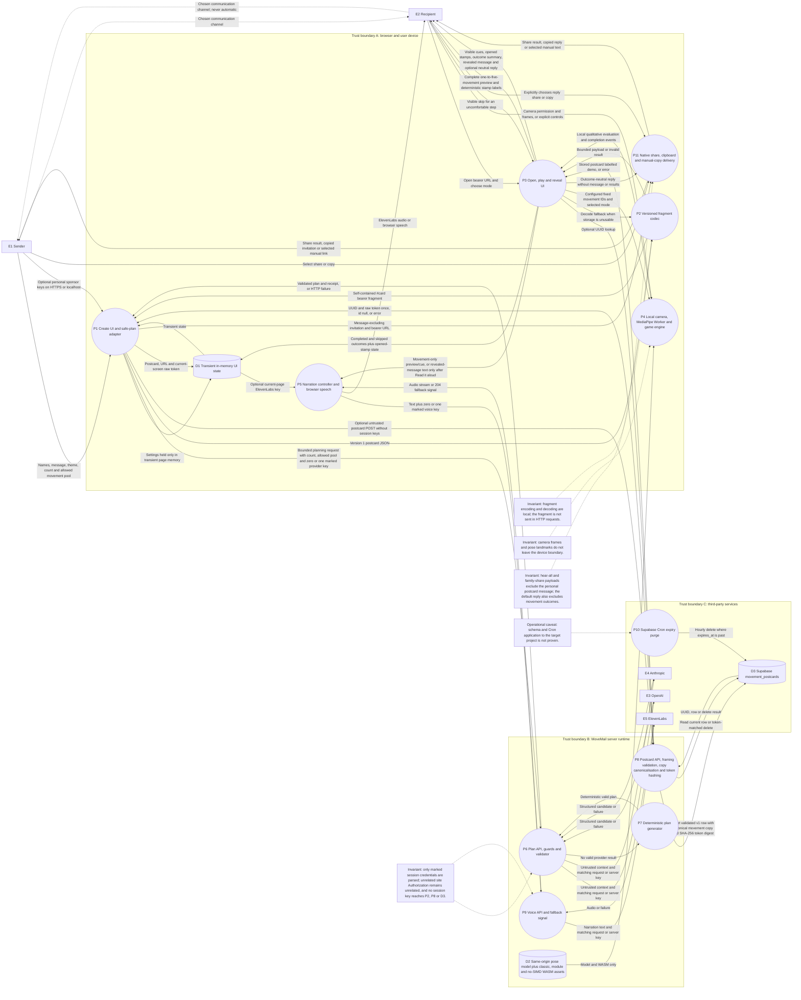

The fragment is an unsigned, unencrypted bearer payload. Stored provider
provenance is explicitly `unverified`. The raw deletion token exists only in
current UI memory and is returned once. Camera frames and landmarks remain on
the recipient's device. Invitation and reply delivery are browser actions:
MoveMail does not automatically send or persist either payload.

## Sequence Diagrams

### Create and share

```mermaid
sequenceDiagram
  autonumber
  actor Sender
  participant UI as Browser: MoveMail client
  participant Cred as Browser: current-page service settings
  participant Frag as Browser: fragment codec
  participant Share as Browser: native share and clipboard
  participant Plan as Server: POST /api/plan
  participant BuiltIn as Server: deterministic planner
  participant OAI as OpenAI Responses API
  participant ANT as Anthropic Messages API
  participant Cards as Server: POST or DELETE /api/postcards
  participant DB as Supabase REST and Postgres

  Note over UI,Frag: User-device trust boundary
  Note over Plan,Cards: Application-server boundary; deployment and Supabase credentials remain here
  Note over OAI,DB: Third-party service boundary

  opt Sender adds personal sponsor test keys
    Sender->>UI: Open Service settings
    UI->>Cred: Validate key format and HTTPS or localhost origin
    Cred->>Cred: Hold keys in page memory only
    Note over Cred,Frag: Keys are never encoded into the postcard or share URL
  end

  Sender->>UI: Enter recipient, sender, message and theme
  Sender->>UI: Choose one to five movements and the allowed movement pool
  Sender->>UI: Create movement postcard
  UI->>UI: Validate fields and start with a built-in theme plan
  UI->>Cred: Build minimum provider attempts
  Cred-->>UI: Unmarked deployment chain or separate OpenAI and Claude attempts
  UI->>Plan: POST bounded context, count and allowed pool with zero or one marked provider key
  Plan->>Plan: Check cross-site origin, rate, 8 KiB body, request fields, selection constraints and credential marker
  Plan->>Plan: For a marked personal key, independently require HTTPS or local loopback HTTP
  Note over UI,Plan: One request never carries both personal LLM keys; an unrelated site Authorization header is not a sponsor credential

  alt Route fails, or client reaches 9.5-second timeout
    UI->>UI: Retain built-in plan and demo provider
  else Planning request is accepted
    opt OpenAI is selected or first eligible attempt
      Plan->>OAI: Untrusted context and strict schema; store false
      alt Candidate succeeds and passes validation
        OAI-->>Plan: Structured movement-plan candidate
      else Timeout, refusal, non-success or invalid candidate
        OAI-->>Plan: Failure
      end
    end

    opt No valid plan yet and Anthropic is eligible in a separate personal request or the server chain
      Plan->>ANT: Untrusted context and shared JSON schema
      alt Candidate succeeds and passes validation
        ANT-->>Plan: Structured movement-plan candidate
      else Timeout, non-success or invalid candidate
        ANT-->>Plan: Failure
      end
    end

    alt A provider produced a valid plan
      Plan->>Plan: Apply product policy and authoritative validation
    else No eligible provider succeeded
      Plan->>BuiltIn: Prefer exact scene, then match whole-word intent
      BuiltIn-->>Plan: Valid plan matching the requested count and allowed pool
    end

    Plan-->>UI: 200 plan, provider and live or demo mode
    UI->>UI: safePlan maps IDs to fixed labels and cues
  end

  UI->>Frag: Encode version 1 postcard JSON
  Frag-->>UI: Self-contained #card bearer fragment
  UI->>UI: Create fragment-only URL before attempting storage

  UI->>Cards: POST validated postcard
  Note over UI,Cards: No session sponsor credential is attached to postcard requests
  Cards->>Cards: Check origin, rate, 16 KiB body and contract
  Cards->>Cards: Require version 1; reject missing or unsupported versions
  Cards->>Cards: Validate framing and one to five distinct movement IDs
  Cards->>Cards: Replace supplied labels and cues with server-owned copy

  alt Supabase write returns a valid UUID
    Cards->>Cards: Generate token and SHA-256 digest
    Cards->>DB: Insert canonical v1 row, unverified provenance and digest
    DB-->>Cards: UUID
    Cards-->>UI: UUID and raw deletion token once
    UI->>UI: Build hybrid UUID plus fragment URL
    UI->>UI: Keep token only in current ready-screen state
  else Supabase is unavailable, invalid or slow
    Cards-->>UI: Encoded-link mode, or client timeout
    UI->>UI: Retain fragment-only URL
  end

  UI-->>Sender: Display copyable bearer URL and Share postcard action
  Sender->>UI: Share postcard
  UI->>Share: Prepared invitation and bearer URL; personal message excluded
  alt Native share succeeds
    Share-->>Sender: Share operation completed
  else Sender cancels native sharing
    Share-->>Sender: Quiet cancellation; no clipboard copy
  else Native share is unavailable or fails
    Share->>Share: Attempt clipboard copy
    alt Clipboard succeeds
      Share-->>Sender: Invitation and link copied
    else Clipboard is unavailable
      UI-->>Sender: Select URL field for manual copying
    end
  end

  opt Sender removes the optional stored copy
    Sender->>UI: Remove saved copy
    UI->>Cards: DELETE UUID with bearer deletion token
    Cards->>Cards: Hash supplied token
    Cards->>DB: Delete row matching UUID and digest
    DB-->>Cards: Deleted row or no match
    Cards-->>UI: Deleted or recoverable error
    UI->>UI: On success, strip UUID and retain fragment
  end
```

### Open, play and reveal

```mermaid
sequenceDiagram
  autonumber
  actor Recipient
  participant UI as Browser: MoveMail client
  participant Cred as Browser: current-page service settings
  participant Frag as Browser: fragment codec
  participant Cards as Server: GET /api/postcards
  participant DB as Supabase REST and Postgres
  participant Pose as Browser: camera and MediaPipe Worker
  participant Game as Browser: calibration and matcher
  participant Voice as Server: POST /api/voice
  participant EL as ElevenLabs
  participant Speech as Browser speech synthesis
  participant Share as Browser: native share and clipboard

  Note over UI,Game: User-device trust boundary
  Note over Cards,Voice: Application-server boundary
  Note over DB,EL: Third-party service boundary

  Recipient->>UI: Open bearer postcard URL
  Note over Recipient,UI: URL fragment is not included in the HTTP request
  Note over Cred,Recipient: A sender's session keys do not travel with this link
  UI->>Frag: Read UUID query and #card fragment
  Frag-->>UI: Stored reference and bounded fallback

  opt A UUID is present
    UI->>Cards: GET postcard with 5.5-second client timeout
    Cards->>DB: Select unexpired row
    alt Current v1 row has expected unverified provenance
      DB-->>Cards: Names, message, theme and canonical plan
      Cards-->>UI: Safe stored postcard labelled demo
    else Missing, expired, unavailable, invalid or slow
      Cards-->>UI: 404 or 503, or client aborts
    end
  end

  alt A valid stored postcard arrived
    UI->>UI: Clamp fields and apply fixed movement copy
  else No valid stored postcard arrived
    UI->>Frag: Decode local fragment fallback
    alt Fragment is valid
      Frag-->>UI: Versioned untrusted postcard
      UI->>UI: Validate IDs and use local demo framing
    else Fragment is missing or damaged
      UI-->>Recipient: Recoverable notice and create screen
    end
  end

  UI-->>Recipient: Safety guidance, mode choice and every selected movement label and cue

  opt Recipient adds a personal ElevenLabs test key
    Recipient->>UI: Open Service settings over HTTPS or localhost
    UI->>Cred: Keep validated key in current-page memory
  end

  opt Recipient selects the movement-plan narration
    UI->>UI: Compose one movement-only narration of at most 450 characters
    Note over UI,Voice: The personal postcard message is not part of this preview request
    UI->>Voice: POST movement text with zero or one marked ElevenLabs key
    alt ElevenLabs succeeds
      Voice->>EL: Movement-only narration text
      EL-->>Voice: Audio stream
      Voice-->>UI: Audio
      UI-->>Recipient: Play preview narration
    else Voice path fails
      Voice-->>UI: 204 fallback or client failure
      UI->>Speech: Speak the same movement-only text
      Speech-->>Recipient: Browser narration
    end
  end

  alt Recipient chooses camera
    Recipient->>UI: Use my camera
    UI->>Pose: Request camera and wait up to 8 seconds for a real first frame
    Pose->>Pose: Probe classic/module Worker loader and load matching same-origin WASM plus model
    alt Camera and Worker remain ready
      loop Maximum 15 FPS and one frame in flight
        Pose->>Pose: Transfer ImageBitmap to local Worker
        Pose->>Pose: Convert frame to landmarks and close frame
        Pose-->>Game: Shoulder and wrist landmarks or a null pose
      end
      Game->>Game: Adapt left/right reach and open-arms targets only
    else Denial, unsupported API, initial-frame timeout, five-second stall or bounded repeated error
      Pose-->>UI: Switch to labelled demo state
      UI-->>Recipient: Show the reason, camera retry and camera-free controls
    end
  else Recipient chooses no camera
    Recipient->>UI: Continue without camera
    UI-->>Recipient: Explicit on-screen controls
  end

  Note over Pose,Game: Frames and landmarks remain on the recipient device

  loop One to five configured movement attempts
    UI-->>Recipient: Visible movement label, cue and progress

    opt Sound is enabled
      UI->>Voice: POST visible cue text with zero or one marked ElevenLabs key
      Voice->>Voice: Check origin, rate, 4 KiB body and text length
      alt ElevenLabs succeeds
        Voice->>EL: Narration text
        EL-->>Voice: Audio stream
        Voice-->>UI: Audio
        UI-->>Recipient: Play narration
      else Service or playback path fails
        Voice-->>UI: 204 fallback or client failure
        UI->>Speech: Speak same visible text
        Speech-->>Recipient: Browser narration
      end
    end

    alt Camera mode remains active
      Pose-->>Game: Current local landmarks or null
      Game->>Game: Normalise and smooth usable poses
      Game->>Game: Keep independent left/right wave evidence
      Game->>Game: Require both arms for open arms; use 0.1-width lift target
      alt Pose is null or observation gap exceeds 500 ms
        Game->>Game: Pause hold and add no unobserved time
      else Current observation is usable
        Game->>Game: Evaluate and update the bounded hold
      end
      Game-->>UI: Qualitative coach state and optional completion event
    else Camera-free mode is active
      UI-->>Recipient: Demo-ready qualitative guidance
    end

    alt Recipient skips this movement
      Recipient->>UI: Select visible skip
      UI->>UI: Record skipped outcome
    else Movement is completed
      alt Camera mode
        Game-->>UI: Completion event after observed hold
      else Camera-free mode
        Recipient->>UI: Completion button or approved Space or Enter
      end
      UI->>UI: Record completed outcome
    end
    UI->>UI: Open deterministic theme-and-movement stamp for this attempted step
    UI-->>Recipient: Show stamp as opened without earned/completed language
  end

  UI->>Pose: Stop stream, Worker and animation loops
  UI-->>Recipient: Reveal personal message with completed/skipped summary
  opt Recipient explicitly selects Read it aloud
    Recipient->>UI: Read it aloud
    UI->>Voice: POST revealed message with zero or one marked ElevenLabs key
    Voice->>Voice: For a marked personal key, require HTTPS or local loopback HTTP
    Voice-->>Recipient: ElevenLabs audio or browser speech fallback
  end
  UI-->>Recipient: Offer outcome-neutral reply; nothing sent automatically
  Recipient->>UI: Select Share this reply
  UI->>Share: Prepared opened-postcard reply without message or movement results
  alt Native share succeeds
    Share-->>Recipient: Share operation completed
  else Recipient cancels native sharing
    Share-->>Recipient: Quiet cancellation; no clipboard copy
  else Native share is unavailable or fails
    Share->>Share: Attempt clipboard copy
    alt Clipboard succeeds
      Share-->>Recipient: Reply copied
    else Clipboard is unavailable
      UI-->>Recipient: Select visible reply text for manual copying
    end
  end
```

The recommended three-movement demo is intended to take about 60 seconds.
One- to five-movement postcards vary in length, and the state machine does not
enforce a hard countdown.

## Behaviour and Operational Views

### Client journey state machine

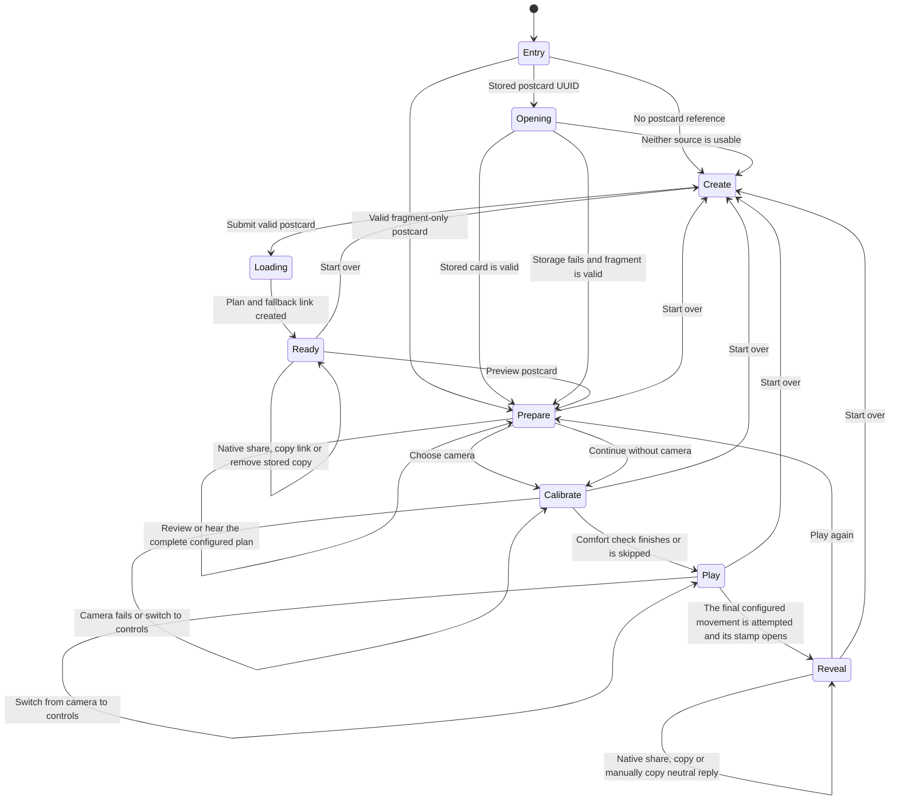

### AI planning safety pipeline

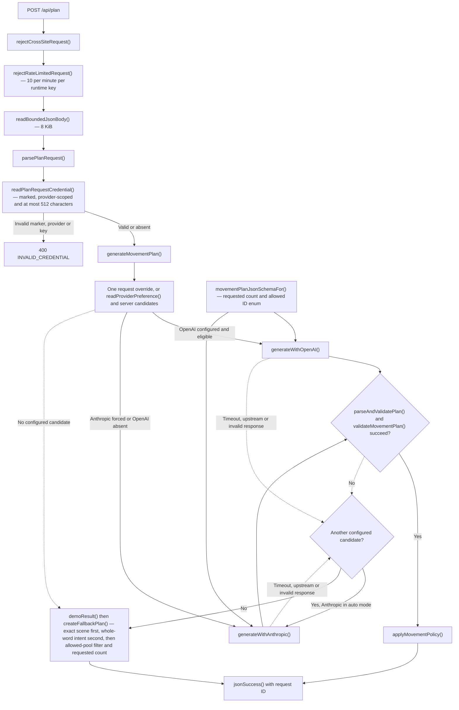

### Graceful-degradation decision map

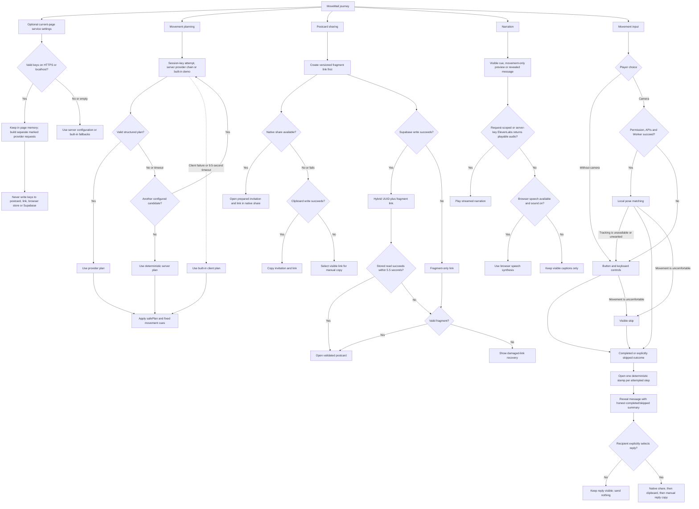

### Dual-target deployment topology

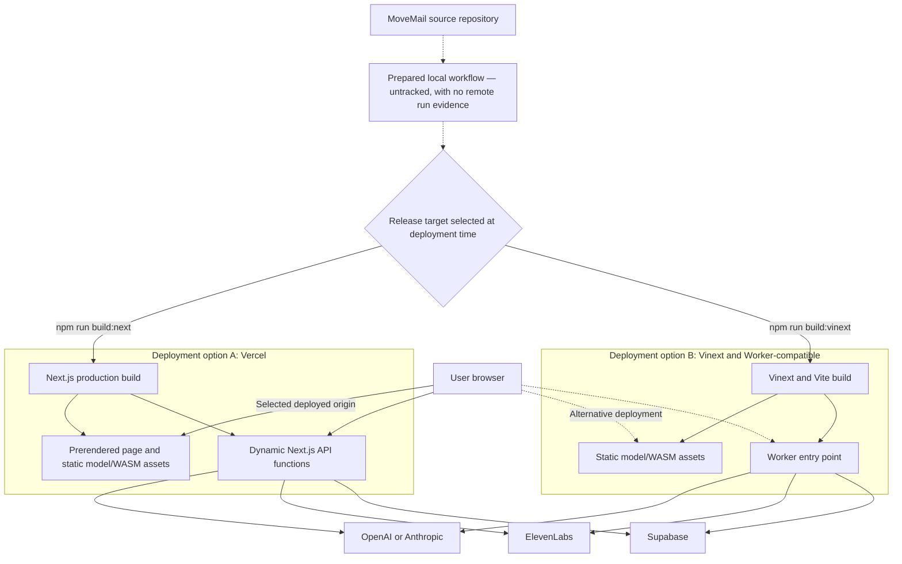

Vercel and the Vinext/Worker path are alternatives, not simultaneous production
dependencies. Applying production environment variables, the Supabase migration,
the Cron job and a distributed WAF remains an operational responsibility.
The `.github/workflows/verify.yml` definition is prepared in the local working
tree but is untracked. The configured GitHub remote is accessible, but the
workflow has not been committed, pushed, observed successfully or made a
required check; until then the CI path in this diagram is not release evidence.

## Component Details

### Client application

- **Responsibilities:** form state, screen transitions, link creation and
  opening, provider receipts, pre-game preview, narration lifecycle, camera/demo
  choice, session-only service settings, calibration, movement outcomes, memory
  stamps, message reveal, mobile on-device camera disclosure and optional family
  sharing.
- **Technology:** React 19 client component rendered through the Next.js App Router.
- **Data transformed:** form input, transient personal sponsor keys, provider
  plans, stored postcards and embedded URL-fragment postcards.
- **External dependencies:** the three same-origin API routes and browser media,
  native-share, clipboard, audio and speech APIs.
- **Failure modes:** unavailable native sharing, clipboard denial, audio
  autoplay restrictions, invalid/insecure-origin settings, damaged links and
  unsupported camera capabilities. Each has an in-product fallback or
  recoverable state.

The client applies `safePlan` before using a provider, stored or embedded plan.
For a newly generated plan it enforces the requested count and allowed pool;
stored and embedded plans must contain one to five supported, distinct
identifiers. Labels and movement cues are then taken from the fixed local
vocabulary. Embedded links additionally discard embedded provider provenance
and generated prose, representing the story as the built-in demo.

`lib/movements/catalogue.ts` is the single source of truth for the nine approved
identifiers and their provider-facing safety descriptions. The plan validator,
postcard boundary, client adapter and game engine all consume that catalogue;
they still validate their own external data shapes independently.

`lib/postcards/contract.ts` owns postcard contract version 1, the exact theme
set, shared name/message/framing limits, one-to-five movement bounds and the core
postcard types. The client uses those values to build and decode cards. It does
not replace the client's `safePlan` checks or the postcard API parser.

`lib/ui/postcard-preview.ts` owns the deterministic theme-and-movement stamp
labels and composes the optional plan narration. Its hear-all boundary accepts
movement copy only, requires one to five items and caps the result at 450
Unicode code points. `lib/ui/family-share.ts` prepares a sender invitation
with the bearer URL and an outcome-neutral recipient reply. Neither payload
accepts the personal postcard message; the default reply also omits movement
outcomes. `lib/ui/share-delivery.ts` tries native sharing, then the clipboard,
and leaves the caller with visible manual text if neither is available. These
are explicit browser actions rather than automatic delivery or persistence.

`lib/http/request-credentials.ts` also runs in the client bundle. It validates
the story-service choice and visible, whitespace-free ASCII keys up to 512
characters; rejects personal credentials outside HTTPS or local HTTP loopback;
and builds the smallest request set. Personal OpenAI and Claude keys are sent
in separate requests with both a provider header and the
`X-MoveMail-Credential: session` marker. The ElevenLabs key is isolated to a
marked voice request. Saved settings live in a React ref and visible edit
drafts use React state. Refresh, page close or **Clear my keys** drops the
application's current references; values are not written to Web Storage or
IndexedDB.

### AI planning layer

- **Responsibilities:** validate input, choose the configured provider, request structured output, validate that output and fall back deterministically.
- **Technology:** server-side TypeScript using `fetch`.
- **Data transformed:** theme, message, optional sender/recipient names,
  requested count and allowed movement pool into a title, opening line, the
  requested movement identifiers and closing line.
- **External dependencies:** OpenAI Responses API and Anthropic Messages API.
- **Failure modes:** missing credentials, timeout, non-success response, refusal, malformed JSON or a plan that fails local validation.

Without a personal key, `LLM_PROVIDER=auto` tries server-configured OpenAI first
and then server-configured Anthropic. A successful provider stops the chain. A
forced provider mode tries only that provider. With personal keys, the browser
sends separate provider-scoped requests; a request credential becomes the sole
provider candidate for that request and cannot spend a deployment key after it
fails. Each provider attempt has a 4.5-second timeout; the browser gives each
plan request 9.5 seconds. The deterministic result is still returned as a
successful response when no provider succeeds.

Deployment-configured OpenAI and Anthropic credentials also use independent
per-runtime circuit state. Three consecutive failures open only that provider's
circuit for 30 seconds. After the cooldown, one half-open probe is permitted;
success closes the circuit and failure reopens it. An open candidate records a
content-free `circuit-open` diagnostic and the chain continues to the next
provider or deterministic demo. Request-scoped personal keys bypass this shared
state so one person's invalid key cannot affect another request.

The request-specific JSON Schema uses the subset supported by both providers
and narrows the movement-ID enum to the sender's allowed pool. Local validation
remains authoritative: it requires exact keys, the requested one-to-five count,
different identifiers drawn only from that pool, bounded text and no detected
medical claim. The parser defaults omitted selection fields to three movements
and all nine IDs for backward compatibility. OpenAI requests set `store: false`.

Provider output is transient: it is validated and synchronously mapped into the
version-1 postcard contract rather than persisted as an independent provider
document. A provider-only schema change therefore updates both adapters and
their tests atomically but does not receive a stored migration version. Only a
change to a persisted or shared postcard shape increments
`POSTCARD_CONTRACT_VERSION` and requires a migration.

The deterministic server and client fallbacks start with a theme-preferred
ordering, remove IDs outside the sender's allowed pool, de-duplicate it and
take the requested count. The default Brighton path therefore remains
`gentle_wave`, `reach_left`, `open_arms`, while a narrowed pool or different
count is honoured without depending on either model provider.

The route accepts a bearer key as a sponsor credential only when the request
also carries the exact session marker and a valid OpenAI/Anthropic provider
header. This prevents an unrelated private-site `Authorization` header from
being reinterpreted and forwarded to a sponsor.

### Pose and game engine

- **Responsibilities:** camera lifecycle, worker initialisation, frame
  throttling, landmark smoothing, confidence checks, side-range adaptation,
  movement matching, qualitative feedback and hold hysteresis.
- **Technology:** MediaPipe Tasks Vision, a module Web Worker and pure TypeScript game functions.
- **Data transformed:** camera frames into pose landmarks, then shoulder-width-normalised wrist geometry and game progress.
- **External dependencies:** same-origin MediaPipe model and WASM files.
- **Failure modes:** denied permission, no camera, unsupported browser APIs, slow model initialisation, missing pose, low confidence or a worker error.

Capture is limited to 15 frames per second and only one frame is in flight. A
dedicated off-screen video owned by the hook supplies frames independently of
the React preview, so screen transitions cannot break capture startup; the same
stream is attached to whichever preview is mounted. The client uses shoulder and
wrist landmarks. The comfort check waits for active tracking. It samples only
the selected left reach, right reach or open-arms action with bounded
percentiles, and skips that phase when the final plan has no such movement.
Those observations adapt the relevant side-reach and open-arms targets to 75%
of the observed ranges. Other movements use conservative fixed settings or
temporal evidence and are not described as individually calibrated.

Camera acquisition waits up to eight seconds for `loadeddata` or `canplay` and
requires `readyState >= HAVE_CURRENT_DATA` before Worker initialisation.
MediaPipe publishes separate classic and module Worker loaders, so
`lib/pose/workerRuntime.ts` probes `importScripts()` and selects the matching
loader. The synchronisation script copies all six loader assets into
`public/wasm` before development, Vinext builds and Next builds.

After startup, a non-ready video state is allowed for five seconds.
`captureWatchdog.ts` also measures an in-flight frame from transfer until the
Worker settles it, so a silent Worker cannot leave capture blocked indefinitely.
Five seconds without that response, three consecutive frame-capture errors,
three consecutive non-fatal Worker errors, a fatal Worker error or a video-frame
stall triggers resource cleanup and the labelled camera-free state. The
specific error remains visible and the player can retry camera acquisition.

Wave evidence is maintained independently for each hand. Open arms requires
both arms to meet their own side target, and the two-hand lift uses a
near-shoulder target of 0.1 shoulder widths. A null pose pauses progress, and an
observation gap longer than 500 ms adds no hold time. The client turns engine
state into qualitative coaching rather than a confidence percentage. A player
can use the default range, switch to on-screen controls or explicitly skip a
movement; skipped and completed outcomes remain distinct. An attempted outcome
opens the deterministic stamp for that movement and scene regardless of whether
the movement was completed or skipped. The UI does not call this stamp earned
or use it as a fitness score.

The matcher's normalised values are game mechanics only. They are not stored, sent to an API or presented as health measurements.

### Postcard service

- **Responsibilities:** validate and version postcard payloads, write/read/delete optional Supabase records, distinguish not-found from unavailable storage, record honest provenance, and preserve the embedded-link fallback.
- **Technology:** Next.js route handlers calling Supabase REST with a server-held service-role key.
- **Data owned:** no local server database. When configured, Supabase owns names, message, theme, plan, unverified provenance, a deletion-token digest and timestamps.
- **External dependency:** Supabase.
- **Failure modes:** missing configuration, timeout, upstream error, invalid upstream data or an expired/missing record.

Creation degrades to `{ id: null, mode: "encoded-link" }` rather than failing the journey. A successful stored link contains both `?postcard=<uuid>` and the embedded `#card=<payload>` fallback. Opening first tries storage for 5.5 seconds and then uses the fragment if necessary.

Stored and embedded paths obtain version 1, themes, common display limits and
core shapes from `lib/postcards/contract.ts`. Each path still validates
untrusted runtime data independently. Creation requires the actual shared
`version` field to equal 1; a missing or unsupported version is rejected before
storage and is never silently restamped. Stored contract version 1 ignores any
provider identity supplied by the client.
It validates title, opening and closing text with the same authoritative
unsafe/medical policy as provider plans, requires one to five supported,
distinct movement IDs, and regenerates labels and cues from server-owned copy.
It then
persists `provider=unverified` with `provider_provenance=postcard-api`.
Creation returns a 256-bit deletion token once; only its SHA-256 digest is
stored. The creating browser may use that token with `DELETE /api/postcards` in
the current ready-screen session. The schema provides an hourly `pg_cron` job
that physically removes expired rows. Applying that schema to a particular
remote project remains an operational step, not a fact established by the
repository.

Session sponsor headers are not attached to postcard create/read/delete calls.
Supabase uses only its server-side service-role environment credential; no
personal OpenAI, Claude or ElevenLabs key is accepted, embedded or persisted by
this service.

### Voice service

- **Responsibilities:** validate narration text, proxy ElevenLabs audio and explicitly signal browser fallback.
- **Technology:** a Next.js route streaming the upstream audio response.
- **Data transformed:** up to 450 characters of text into audio.
- **External dependency:** ElevenLabs.
- **Failure modes:** missing configuration, 5.5-second timeout, non-success response or empty audio.

Failure returns `204 No Content` with `X-MoveMail-Voice: browser-fallback`. The client then uses browser speech synthesis while keeping visible captions. It owns one narration token and audio object URL at a time, so later speech cancels and releases earlier playback.

A marked, bounded request credential overrides the server ElevenLabs key only
for that voice request. An unmarked site `Authorization` header is ignored as a
sponsor key. Marked personal voice credentials are independently rejected by
the route on non-loopback plain HTTP. The route does not return the key in its
response or diagnostics.

The pre-game **Hear the movement** or **Hear all N** action sends one composed,
capped request for every visible movement label and cue in the one-to-five-item
plan. It does not include the personal postcard message. Repeated user
activation remains subject to the same client-cancellation, endpoint-size and
runtime-rate boundaries as other narration.

The revealed personal message is never narrated automatically. The recipient
must select **Read it aloud**. The creation form discloses that this explicit
action may send the message to ElevenLabs; a missing or failed voice service
still falls back to browser speech and visible text.

### HTTP response layer

JSON routes use a shared contract and `Cache-Control: no-store`:

```json
{
  "ok": false,
  "error": {
    "code": "STABLE_CODE",
    "message": "Safe user-facing explanation.",
    "requestId": "correlation-id"
  }
}
```

Successful JSON responses include `ok: true` and the same request ID in the body and `X-Request-Id` header. Audio success and `204` fallback responses use headers rather than a JSON body. Browser cross-site requests are rejected using `Origin` and `Sec-Fetch-Site`; this is a defence-in-depth browser control, not authentication.

Plan and voice routes parse optional request credentials only when
`X-MoveMail-Credential: session` is present. Plan requests also require a valid
`X-MoveMail-Provider`. Missing or malformed marked credentials return
`400 INVALID_CREDENTIAL` before a sponsor call. Unmarked `Authorization`
continues to belong to the hosting site and is not treated as a sponsor key.
When a marked personal key is present, both routes also apply the HTTPS/local
loopback origin rule independently of the client.
Application diagnostics use the versioned `movemail.dependency` allow-list:
schema version, event name, request ID, provider, operation, category, status and
a finite non-negative duration. The builder reconstructs the object and
replaces invalid caller-controlled request IDs, categories and statuses.
Callers cannot add postcard content, names, request headers, API-key values,
audio or camera data to the emitted object.

Request streams are counted before JSON parsing: plan accepts at most 8 KiB,
postcard writes 16 KiB and voice 4 KiB. A salted, hashed per-address token
bucket permits 10 plan, 20 postcard-write, 10 postcard-delete and 30 voice
requests per minute per runtime instance. `413` and `429` responses use the
shared contract; `429` includes `Retry-After`. These in-memory buckets are a
bounded application backstop, not a replacement for a distributed platform/WAF
policy.

## Data Flow

### Configure optional personal sponsor keys

1. A user opens **Service settings** and may choose automatic, OpenAI, Claude or
   built-in story mode, plus optional OpenAI, Anthropic and ElevenLabs keys.
2. The client trims outer whitespace, then rejects remaining whitespace,
   non-ASCII/control characters or more than 512 characters, and refuses
   non-local plain HTTP origins.
3. Accepted values are kept in current-page React memory only. Refresh, close or
   **Clear my keys** drops the application's references to them.
4. The client creates a marked `Authorization` header only for the matching
   plan or voice request. Automatic OpenAI and Claude attempts are separate.
5. The same-origin plan or voice route validates the session marker and bearer
   shape, independently rejects a marked personal key on non-loopback plain
   HTTP, then uses the key only for the matching sponsor call. Plan requests
   also require the matching provider marker. Neither route echoes the value.
6. No credential is passed to the fragment codec, postcard API, native-share
   copy or Supabase. Deployment-wide provider keys, Supabase service roles and
   hosting tokens remain server environment configuration.

### Create and share

1. The sender enters names, a message and a theme, selects a movement count
   from one to five and chooses the allowed subset of the fixed library.
2. The client rejects an allowed pool smaller than the requested count, then
   posts the bounded values and selection to `/api/plan`, with zero or one
   marked provider key selected from current-page settings.
3. The route validates the request, selection and credential boundary, then
   asks only the selected provider for the request-specific shared schema.
   Without a personal key, the server-configured provider chain remains
   available.
4. Provider output is locally validated. A deterministic plan replaces
   unavailable or invalid output; exact scene choices take precedence and
   message-only classification uses whole-word intent.
5. The client maps movement identifiers to the fixed labels and cues.
6. The client immediately creates a self-contained base64url payload in the URL fragment. Fragments are not part of HTTP requests.
7. The client also posts the postcard to `/api/postcards` without any session
   sponsor header. The route revalidates visible framing and IDs and replaces
   physical labels/cues with canonical server-owned copy.
8. If Supabase returns a UUID and one-time deletion token, the share URL contains that UUID plus the fragment fallback and the ready screen offers removal of the optional stored copy. Otherwise the fragment-only URL remains usable.
9. **Share postcard** prepares an invitation plus that bearer URL. The browser
   tries native sharing, then clipboard copying, then focuses and selects the
   visible link for manual copying. The invitation excludes the personal
   postcard message.

### Open and play

1. A stored-link recipient sees an opening state while `/api/postcards` is queried.
2. A valid, unexpired Supabase record is adapted through the same client safety boundary.
3. If storage is unavailable, invalid or slow, the client decodes the bounded fragment payload.
4. The recipient reviews every fixed movement label and cue in the configured
   one-to-five-item sequence. If requested, **Hear the movement** or
   **Hear all N** narrates that movement-only preview in one bounded call.
5. The recipient selects camera tracking or on-screen controls.
6. Camera mode loads the local model and WASM, adapts side-reach/open-arms
   targets in the comfort check, and evaluates each movement with qualitative
   coaching. Demo mode advances only from an explicit button or a
   non-interactive Space/Enter event.
7. Either mode exposes a movement skip. Every completed or skipped outcome
   opens its deterministic theme-and-movement stamp without treating a skip as
   completed or earned.
8. After the final configured outcome, the client stops camera capture and
   reveals the message with an honest completed/skipped summary.
9. The recipient may explicitly share an outcome-neutral opened-postcard reply
   through native share, clipboard or manual copying. The reply is not
   automatically sent or stored and excludes both the postcard message and
   movement results.

### Narration

1. A visible cue or complete movement-only plan preview is posted to
   `/api/voice` when its corresponding narration action or movement lifecycle
   calls for it. Revealed-message text is posted only when the recipient
   explicitly selects **Read it aloud**, optionally with the marked current-page
   ElevenLabs key.
2. ElevenLabs audio is streamed when a valid request or server credential is
   available.
3. A `204` response, client timeout or playback failure activates browser speech synthesis.
4. Disabling sound, changing cue or leaving the session cancels current narration and releases its object URL.

The preview path is intentionally narrower than the opt-in reveal narration: it is
built from the reviewed movement labels and cues only, so preparing the session
does not disclose the postcard message to the voice route.

## Data Model

### Session service settings

| Field | Constraint and lifetime |
| --- | --- |
| `storyService` | `auto`, `openai`, `anthropic` or `demo`; current page only |
| `openAIKey` | Optional visible, whitespace-free ASCII value, at most 512 characters; current page only |
| `anthropicKey` | Optional visible, whitespace-free ASCII value, at most 512 characters; current page only |
| `elevenLabsKey` | Optional visible, whitespace-free ASCII value, at most 512 characters; current page only |

This object is held in React/page memory and is not part of the postcard model.
It is not serialised to browser storage, URL state, Supabase or family-share
copy.

### Plan request

| Field | Constraint |
| --- | --- |
| `theme`, `message`, `to`, `from` | Bounded sender context; the message is required |
| `moveCount` | Whole number from 1 to 5; defaults to 3 when omitted |
| `allowedMovementIds` | Distinct supported IDs, with at least `moveCount` entries; defaults to all nine when omitted |

The sender's allowed pool is a planning constraint rather than stored
configuration. The final postcard contains only the selected plan, so the
recipient does not need the larger pool to play it.

### Provider plan

| Field | Constraint |
| --- | --- |
| `themeTitle` | Non-empty generated text, at most 80 Unicode code points |
| `openingLine` | Non-empty generated text, at most 180 code points |
| `moves` | Array of one to five objects containing only a supported `id`; its length must equal the request's `moveCount`, every ID must be distinct and every ID must belong to the request's `allowedMovementIds` |
| `closingLine` | Non-empty generated text, at most 180 code points |

### Client postcard

| Field | Meaning |
| --- | --- |
| `toName`, `fromName` | Display names, at most 40 code points in the normal creation path |
| `message` | Personal note, at most 400 code points in the normal creation path |
| `theme` | `seaside`, `garden` or `dance` |
| `plan` | Adapted title, opening, closing and one to five fixed-vocabulary movement objects; storage regenerates physical labels/cues |
| `provider` | `openai`, `anthropic` or `demo` for the active client plan; embedded and retrieved stored cards are always presented as `demo` because their provenance is not verified |

The version, theme values, shared limits and TypeScript shapes in this table are
owned by `lib/postcards/contract.ts`; the table documents that executable
contract rather than defining a second one.

### Supabase row

New `movement_postcards` rows store a UUID primary key, contract version, names,
message, theme, canonicalised JSON plan, `unverified` provider provenance, a SHA-256 deletion-token
digest, `created_at` and `expires_at`. The default expiry is 30 days. Reads made
by the application require `expires_at` to be in the future. The supplied schema
schedules `purge_expired_movement_postcards()` hourly and revokes direct
anonymous/authenticated access. A token-authorised API route provides voluntary
early deletion for newly created stored copies.

Existing rows created before the deletion-token migration have no token and
cannot use that route. Whether the migration and cron extension are enabled in
the intended remote Supabase project is not proven by this repository.

### URL-fragment postcard

The fallback is base64url-encoded JSON whose encoded payload is capped at 6,000 characters before decoding. It is a bearer payload, not encryption or a signature. It has no independent expiry or revocation mechanism. Anyone who receives it can read or alter the personal fields; the decoder mitigates movement and provider tampering but cannot authenticate the sender.

## Infrastructure and Deployment

### Vercel path

- `vercel.json` installs with `npm ci`.
- Production builds use `npx next build`.
- `/` is prerendered; the three API routes are dynamic server functions.
- Runtime secrets are expected as environment variables.
- Static pose assets are served from `public/models` and `public/wasm`.

### Vinext and Cloudflare-compatible path

- Local development, the default `build`, `start` and test render use Vinext and Vite.
- `predev`, `prebuild:vinext` and `prebuild:next` run the MediaPipe asset
  synchroniser so classic, module and no-SIMD loader pairs match the installed
  package.
- `worker/index.ts` is the Cloudflare Worker entry point.
- The Worker applies the same shared security headers as the Next.js path. Static-asset caching remains host-specific.
- The Cloudflare plugin is configured for optional D1 and R2 bindings.
- `.openai/hosting.json` currently sets both `d1` and `r2` to `null`; MoveMail does not use either store.

The two build paths increase hosting flexibility but create parity risk. Both must be checked before release.

### Configuration

| Capability | Server environment | Optional current-page setting |
| --- | --- | --- |
| Provider choice | `LLM_PROVIDER` | `auto`, OpenAI, Claude or built-in demo |
| OpenAI | `OPENAI_API_KEY`, `OPENAI_MODEL` | Personal OpenAI key |
| Anthropic | `ANTHROPIC_API_KEY`, `ANTHROPIC_MODEL` | Personal Claude key |
| ElevenLabs | `ELEVENLABS_API_KEY`, `ELEVENLABS_VOICE_ID`, `ELEVENLABS_MODEL` | Personal ElevenLabs key |
| Supabase | `SUPABASE_URL`, `SUPABASE_SERVICE_ROLE_KEY` | None; server-only |
| Canonical metadata origin | `NEXT_PUBLIC_SITE_URL` | None |
| Hosting/deployment | Platform-specific server secrets | None; server-only |

Node.js 22.13 or newer is required by the repository.

## Scalability and Reliability

- The server routes are stateless and can be replicated by the hosting platform, but no load test or capacity claim has been made.
- Pose computation is pushed to each client device, reducing server work at the cost of a sizeable model/WASM download and client CPU use.
- The Vercel deployment configures model and WASM responses for a seven-day browser cache plus one day of stale-while-revalidate. The local Vinext server uses its unambiguous one-hour host default, so final deployment headers still require a smoke check.
- Provider failover is sequential to avoid calling both models after a success. This bounds cost in the common case but can add the duration of two failed attempts.
- Client and server timeouts are aligned: 9.5 seconds for the overall plan request, 5.5 seconds for storage and 6.5 seconds for client voice handling.
- Storage creation is not retried automatically because duplicate writes would be possible.
- Every optional service has a deterministic or browser-native fallback.
- There is no repository-level authentication, per-user account quota or
  platform rate-limit configuration. Pre-parse byte limits and per-runtime token
  buckets reduce accidental and single-instance abuse, but public sponsor-backed
  routes remain exposed to distributed scripted cost and storage abuse when
  credentials are enabled.
- Availability, latency and recovery objectives have not been defined.

## Security and Compliance

- Deployment-wide provider, ElevenLabs, Supabase service-role and hosting
  credentials are read only on the server; `.env*` files are ignored except for
  `.env.example`.
- Personal OpenAI, Claude and ElevenLabs keys are an explicit current-page
  option. They stay in page memory, are gated to HTTPS or localhost in the
  browser and again by the receiving plan/voice route, and pass through a
  same-origin MoveMail route only for the matching sponsor request.
- A session marker distinguishes sponsor credentials from unrelated site
  authorisation. Each request contains at most one personal key; no key is
  written to a postcard, link, Web Storage, IndexedDB, Supabase row, response or
  application diagnostic.
- Memory-only handling is not a secure vault. A compromised page, origin,
  browser extension or device could still access an entered key; only
  restricted, low-spend test keys should be used.
- Supabase RLS is enabled in the supplied schema; anonymous and authenticated table roles are revoked, while the server service role has access.
- Camera frames and landmarks are not sent to MoveMail APIs or stored.
- Message text and names can be sent to OpenAI or Anthropic for planning. The
  revealed message is sent to ElevenLabs only when the recipient explicitly
  chooses **Read it aloud**. Configured Supabase stores postcard content.
- OpenAI requests explicitly set `store: false`. Equivalent external retention behaviour for every provider has not been assessed here.
- New fallback links place content in the URL fragment and use `Referrer-Policy: no-referrer`. Legacy `?card=` links are migrated in browser history, although their first request has already reached the host.
- `X-Content-Type-Options`, frame denial and a restrictive Permissions Policy are configured. The Content Security Policy is report-only and therefore does not yet enforce a boundary.
- Browser origin/fetch-site rejection reduces casual cross-site use but does not stop direct HTTP clients that omit those headers.
- There are no accounts, authenticated senders, recipient authorisation or signed
  cards. Stored/embedded provider provenance is deliberately presented as
  unverified rather than trusted.
- New stored copies have a token-authorised deletion path and the supplied
  schema has an hourly expiry purge. Fragment copies remain outside server
  control and cannot be revoked.
- Stored UUIDs and embedded fragments are bearer credentials. Sharing either grants access.
- MoveMail has not been assessed or represented as compliant with healthcare, medical-device or data-protection regulation. It should not be deployed for sensitive or clinical data without a separate legal, privacy and security review.

## Observability

The API layer emits versioned `movemail.dependency` JSON events for bounded
provider and Supabase operations. The fixed allow-list contains request ID,
provider, operation, category, status and a rounded non-negative duration. It
does not contain message text, names, keys, request headers, upstream bodies,
audio or camera data. Invalid caller-controlled request IDs, categories and
statuses are replaced before serialisation. JSON and audio responses include an
`X-Request-Id` for correlation.

There is no configured metrics backend, tracing system, dashboard, alert, audit
log, uptime monitor or error budget. Hosting-log retention and access controls
are unknown. The timed events are ready for privacy-reviewed aggregation, but
they do not prove service-level trends or alert delivery without an approved
collector and operational configuration.

## Design Decisions and Trade-offs

| Decision | Benefit | Cost or limitation |
| --- | --- | --- |
| Fixed nine-movement vocabulary | Physical instructions do not come from free-form model text | Less generative variety than arbitrary model-written exercises |
| Server-owned stored movement copy | Forged client labels/cues cannot become persisted physical instructions | Stored display copy is intentionally less generative |
| Shared structured-output schema plus local validation | Consistent OpenAI/Anthropic contract and deterministic safety checks | Schema must stay within the common provider subset |
| Local pose Worker | Camera privacy and lower server cost | Large client assets and device-dependent performance |
| On-screen controls as an equal path | Demo and accessibility survive camera failure | Manual completion is based on user acknowledgement, not detection |
| Sender-selected count and allowed pool | The family can keep a postcard short and exclude movements that are not a good fit | The AI has less thematic freedom; the client and server must enforce that the pool contains at least the requested one-to-five count |
| Visible movement skip | A recipient never has to claim completion or push through discomfort | The message rewards the configured attempted sequence rather than proving detected movements |
| Fragment fallback on every share link | Storage outages do not break a sent postcard | Payload is unsigned, visible to recipients and cannot be revoked |
| Optional Supabase persistence | Shorter identifiers, token deletion and a bounded read/retention lifetime | Personal content is stored; live migration and cron operation must be verified |
| Sequential provider failover with isolated runtime circuit breakers | Avoids unnecessary dual calls after success and suppresses repeated calls to a failing deployment provider | First failures can still consume most of the client time budget; circuit state is not shared across serverless instances |
| Optional current-page sponsor keys | Judges and developers can exercise their own OpenAI, Claude or ElevenLabs account without deployment access | Keys transit the MoveMail server and remain exposed to page/origin compromise; use restricted low-spend test keys only |
| Versioned timed dependency events with a fixed content-free allow-list | Consistent latency, fallback and failure evidence with lower privacy risk | No approved collector, retention policy, dashboard, alert or user-level audit trail |
| Dual Next/Vinext builds with shared security headers | Vercel and Cloudflare-compatible workflows | More dependencies, host-specific asset caching and release-parity risk |

## Future Improvements

The [MoveMail action register](ACTION_REGISTER.md) is the authoritative status
and closure-evidence list. Locally completed on 26 July 2026 are the
classic/module camera loader and asset synchronisation, bounded camera readiness
and silent-Worker recovery, the enforced shared postcard version, the resolved
transient provider-schema policy, sanitised dependency events, server-side
personal-key origin guards, explicit-only personal-message narration and the
mobile on-device camera note. The regression suite contains 168 passing Node
tests plus six deterministic Chromium journeys.

1. Select either the Vercel/Next or Vinext/Cloudflare production target,
   configure it and retain deploy, smoke-test and rollback evidence.
2. Configure distributed platform rate limits, quotas and an abuse budget before enabling sponsor credentials publicly.
3. Add sender authentication or server-side signatures if provider/sender provenance must be trusted.
4. Apply and verify the supplied Supabase contract-v1, deletion and purge migration on the intended live project; document the final retention policy.
5. Run the report-only CSP in representative browsers, remove unnecessary allowances, then enforce it.
6. Extend browser/device testing to real MediaPipe inference, native sharing,
   clipboard permission states, assistive technology and responsive visual review.
7. Test cold camera start, frame rate and thermal behaviour on representative lower-powered phones and laptops.
8. Connect the implemented privacy-safe timed dependency events to an approved
   metrics collector, retention policy, dashboards and alerts.
9. Validate the core product and accessibility assumptions with older participants or relevant carers before making outcome claims.

The six completed deterministic Chromium journeys cover fragment-only reveal,
stored-read failure with embedded fallback, focus transfer and Space completion,
personal-key memory/clear/insecure-origin behaviour, in-flight narration
cancellation and denied-camera recovery controls. They are local automated
evidence, not physical-device, native-share, live-provider, CSP or user evidence.

### Explicit Unknowns

- Whether Vercel/Next or Vinext/Cloudflare is the final production target, and
  which sponsor credentials and provider models it will enable.
- Whether the checked-in Supabase migration has been applied to a live project.
- Whether the checked-in hourly database purge is active in a remote project,
  and whether a Vercel firewall rule or monitoring control exists outside this
  repository.
- Whether the prepared local workflow's first remote run will pass and whether
  branch protection will require it. The configured GitHub remote is accessible,
  but the workflow remains untracked and has no remote run evidence.
- Real traffic volume, cost budget, provider latency distribution and device performance.
- Hosting and third-party log/data retention terms for the intended deployment.
- The final repository licence and operational owner.
