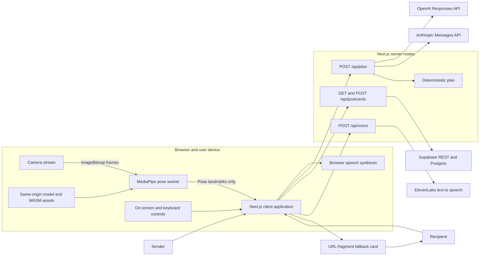

# System Architecture: MoveMail

## Overview

MoveMail is a full-stack web prototype that turns a personal message into a short movement postcard. A sender writes a note and chooses a theme. The server asks one configured language model to select exactly three movements from a fixed five-movement vocabulary and to supply limited story copy. A recipient completes the sequence with local camera tracking or camera-free on-screen controls before the note is revealed.

The product deliberately has a narrow wellbeing boundary. It does not diagnose, prescribe, measure health, verify physical ability or claim a medical outcome. The movement matcher provides game progress, not a clinical score.

The complete journey works without sponsor credentials. OpenAI or Anthropic can plan the sequence, ElevenLabs can narrate it and Supabase can persist it, but deterministic story generation, browser speech, a URL-fragment postcard and on-screen controls are always available as fallbacks.

## Key Requirements

- Produce exactly three distinct movements from `reach_left`, `reach_right`, `open_arms`, `hands_together` and `gentle_wave`.
- Keep movement labels and physical instructions within a fixed, reviewed client vocabulary.
- Treat model output and shared-link content as untrusted input.
- Keep camera frames and pose inference on the user's device.
- Support a camera-free journey with equivalent access to the message.
- Remain demonstrable when every optional external service is unconfigured or unavailable.
- Bound provider waits so the main journey cannot stall indefinitely.
- Avoid medical claims and tell users to stop if movement is painful, dizzying or uncomfortable.
- Protect server-side credentials from the browser.
- Make privacy limitations visible: postcards are bearer links, not encrypted private messages.

## High-Level Architecture



Camera frames cross the boundary between the video element and a Worker on the same device. They do not cross the browser/server boundary. Personal message text can cross that boundary when the planning, storage or ElevenLabs narration paths are used.

## Component Details

### Client application

- **Responsibilities:** form state, screen transitions, link creation and opening, provider receipts, narration lifecycle, camera/demo choice, calibration, movement progress and message reveal.
- **Technology:** React 19 client component rendered through the Next.js App Router.
- **Data transformed:** form input, provider plans, stored postcards and embedded URL-fragment postcards.
- **External dependencies:** the three same-origin API routes and browser media, clipboard, audio and speech APIs.
- **Failure modes:** unavailable APIs, clipboard denial, audio autoplay restrictions, damaged links and unsupported camera capabilities. Each has an in-product fallback or recoverable state.

The client applies `safePlan` before using a provider, stored or embedded plan. Movement identifiers must be supported and distinct. Labels and movement cues are then taken from the fixed local vocabulary. Embedded links additionally discard embedded provider provenance and generated prose, representing the story as the built-in demo.

### AI planning layer

- **Responsibilities:** validate input, choose the configured provider, request structured output, validate that output and fall back deterministically.
- **Technology:** server-side TypeScript using `fetch`.
- **Data transformed:** theme, message and optional sender/recipient names into a title, opening line, three movement identifiers and closing line.
- **External dependencies:** OpenAI Responses API and Anthropic Messages API.
- **Failure modes:** missing credentials, timeout, non-success response, refusal, malformed JSON or a plan that fails local validation.

`LLM_PROVIDER=auto` tries configured OpenAI first and then configured Anthropic. A successful provider stops the chain. A forced provider mode tries only that provider. Each provider attempt has a 4.5-second timeout; the browser gives the overall plan request 9.5 seconds. The deterministic result is still returned as a successful response when no provider succeeds.

The shared JSON Schema uses the subset supported by both providers. Local validation remains authoritative: it requires exact keys, exactly three different supported identifiers, bounded text and no detected medical claim. OpenAI requests set `store: false`.

### Pose and game engine

- **Responsibilities:** camera lifecycle, worker initialisation, frame throttling, landmark smoothing, confidence checks, range calibration, movement matching and hold hysteresis.
- **Technology:** MediaPipe Tasks Vision, a module Web Worker and pure TypeScript game functions.
- **Data transformed:** camera frames into pose landmarks, then shoulder-width-normalised wrist geometry and game progress.
- **External dependencies:** same-origin MediaPipe model and WASM files.
- **Failure modes:** denied permission, no camera, unsupported browser APIs, slow model initialisation, missing pose, low confidence or a worker error.

Capture is limited to 15 frames per second and only one frame is in flight. A dedicated off-screen video owned by the hook supplies frames independently of the React preview, so screen transitions cannot break capture startup; the same stream is attached to whichever preview is mounted. The client uses shoulder and wrist landmarks. Camera calibration waits for active tracking, samples neutral wrist distance and side reaches, uses bounded percentiles to reduce outlier impact, and targets 75% of the observed range. A player can skip calibration or switch to on-screen controls at any point.

The matcher's normalised values are game mechanics only. They are not stored, sent to an API or presented as health measurements.

### Postcard service

- **Responsibilities:** validate postcard payloads, write or read optional Supabase records, distinguish not-found from unavailable storage, and preserve the embedded-link fallback.
- **Technology:** Next.js route handlers calling Supabase REST with a server-held service-role key.
- **Data owned:** no local server database. When configured, Supabase owns names, message, theme, plan, provider label and timestamps.
- **External dependency:** Supabase.
- **Failure modes:** missing configuration, timeout, upstream error, invalid upstream data or an expired/missing record.

Creation degrades to `{ id: null, mode: "encoded-link" }` rather than failing the journey. A successful stored link contains both `?postcard=<uuid>` and the embedded `#card=<payload>` fallback. Opening first tries storage for 5.5 seconds and then uses the fragment if necessary.

### Voice service

- **Responsibilities:** validate narration text, proxy ElevenLabs audio and explicitly signal browser fallback.
- **Technology:** a Next.js route streaming the upstream audio response.
- **Data transformed:** up to 450 characters of text into audio.
- **External dependency:** ElevenLabs.
- **Failure modes:** missing configuration, 5.5-second timeout, non-success response or empty audio.

Failure returns `204 No Content` with `X-MoveMail-Voice: browser-fallback`. The client then uses browser speech synthesis while keeping visible captions. It owns one narration token and audio object URL at a time, so later speech cancels and releases earlier playback.

### HTTP response layer

JSON routes use a shared contract and `Cache-Control: no-store`:

```json
{
  "ok": false,
  "error": {
    "code": "STABLE_CODE",
    "message": "Safe user-facing explanation.",
    "requestId": "correlation-id"
  }
}
```

Successful JSON responses include `ok: true` and the same request ID in the body and `X-Request-Id` header. Audio success and `204` fallback responses use headers rather than a JSON body. Browser cross-site requests are rejected using `Origin` and `Sec-Fetch-Site`; this is a defence-in-depth browser control, not authentication or rate limiting.

## Data Flow

### Create and share

1. The sender enters names, a message and a theme in the browser.
2. The client posts the bounded values to `/api/plan`.
3. The route validates the request and asks the selected provider for the small shared schema.
4. Provider output is locally validated. A deterministic plan replaces unavailable or invalid output.
5. The client maps movement identifiers to the fixed labels and cues.
6. The client immediately creates a self-contained base64url payload in the URL fragment. Fragments are not part of HTTP requests.
7. The client also posts the postcard to `/api/postcards`.
8. If Supabase returns a UUID, the share URL contains that UUID plus the fragment fallback. Otherwise the fragment-only URL remains usable.

### Open and play

1. A stored-link recipient sees an opening state while `/api/postcards` is queried.
2. A valid, unexpired Supabase record is adapted through the same client safety boundary.
3. If storage is unavailable, invalid or slow, the client decodes the bounded fragment payload.
4. The recipient selects camera tracking or on-screen controls.
5. Camera mode loads the local model and WASM, completes the comfort check, and evaluates each movement. Demo mode advances only from an explicit button or a non-interactive Space/Enter event.
6. After the third movement, the client stops camera capture and reveals the message.

### Narration

1. Visible cue or message text is posted to `/api/voice`.
2. ElevenLabs audio is streamed when configured and available.
3. A `204` response, client timeout or playback failure activates browser speech synthesis.
4. Disabling sound, changing cue or leaving the session cancels current narration and releases its object URL.

## Data Model

### Provider plan

| Field | Constraint |
| --- | --- |
| `themeTitle` | Non-empty generated text, at most 80 Unicode code points |
| `openingLine` | Non-empty generated text, at most 180 code points |
| `moves` | Tuple of exactly three objects containing only a supported `id`; identifiers must be distinct |
| `closingLine` | Non-empty generated text, at most 180 code points |

### Client postcard

| Field | Meaning |
| --- | --- |
| `toName`, `fromName` | Display names, at most 40 code points in the normal creation path |
| `message` | Personal note, at most 400 code points in the normal creation path |
| `theme` | `seaside`, `garden` or `dance` |
| `plan` | Adapted title, opening, closing and three fixed-vocabulary movement objects |
| `provider` | `openai`, `anthropic` or `demo`; embedded fallback cards are always treated as `demo` |

### Supabase row

`movement_postcards` stores a UUID primary key, names, message, theme, JSON plan, provider label, `created_at` and `expires_at`. The default expiry is 30 days. Reads made by the application require `expires_at` to be in the future.

Expiry blocks application reads but does **not** physically purge a row. No deletion endpoint or scheduled purge is present.

### URL-fragment postcard

The fallback is base64url-encoded JSON whose encoded payload is capped at 6,000 characters before decoding. It is a bearer payload, not encryption or a signature. It has no independent expiry or revocation mechanism. Anyone who receives it can read or alter the personal fields; the decoder mitigates movement and provider tampering but cannot authenticate the sender.

## Infrastructure and Deployment

### Vercel path

- `vercel.json` installs with `npm ci`.
- Production builds use `npx next build`.
- `/` is prerendered; the three API routes are dynamic server functions.
- Runtime secrets are expected as environment variables.
- Static pose assets are served from `public/models` and `public/wasm`.

### Vinext and Cloudflare-compatible path

- Local development, the default `build`, `start` and test render use Vinext and Vite.
- `worker/index.ts` is the Cloudflare Worker entry point.
- The Worker applies the same shared security headers as the Next.js path. Static-asset caching remains host-specific.
- The Cloudflare plugin is configured for optional D1 and R2 bindings.
- `.openai/hosting.json` currently sets both `d1` and `r2` to `null`; MoveMail does not use either store.

The two build paths increase hosting flexibility but create parity risk. Both must be checked before release.

### Configuration

| Capability | Environment variables |
| --- | --- |
| Provider choice | `LLM_PROVIDER` |
| OpenAI | `OPENAI_API_KEY`, `OPENAI_MODEL` |
| Anthropic | `ANTHROPIC_API_KEY`, `ANTHROPIC_MODEL` |
| ElevenLabs | `ELEVENLABS_API_KEY`, `ELEVENLABS_VOICE_ID`, `ELEVENLABS_MODEL` |
| Supabase | `SUPABASE_URL`, `SUPABASE_SERVICE_ROLE_KEY` |
| Canonical metadata origin | `NEXT_PUBLIC_SITE_URL` |

Node.js 22.13 or newer is required by the repository.

## Scalability and Reliability

- The server routes are stateless and can be replicated by the hosting platform, but no load test or capacity claim has been made.
- Pose computation is pushed to each client device, reducing server work at the cost of a sizeable model/WASM download and client CPU use.
- The Vercel deployment configures model and WASM responses for a seven-day browser cache plus one day of stale-while-revalidate. The local Vinext server uses its unambiguous one-hour host default, so final deployment headers still require a smoke check.
- Provider failover is sequential to avoid calling both models after a success. This bounds cost in the common case but can add the duration of two failed attempts.
- Client and server timeouts are aligned: 9.5 seconds for the overall plan request, 5.5 seconds for storage and 6.5 seconds for client voice handling.
- Storage creation is not retried automatically because duplicate writes would be possible.
- Every optional service has a deterministic or browser-native fallback.
- There is no repository-level authentication, per-user quota, request-body byte limit or platform rate-limit configuration. Public sponsor-backed routes therefore remain exposed to scripted cost and storage abuse when credentials are enabled.
- Availability, latency and recovery objectives have not been defined.

## Security and Compliance

- Provider, ElevenLabs and Supabase credentials are read only on the server and `.env*` files are ignored except for `.env.example`.
- Supabase RLS is enabled in the supplied schema; anonymous and authenticated table roles are revoked, while the server service role has access.
- Camera frames and landmarks are not sent to MoveMail APIs or stored.
- Message text and names can be sent to OpenAI or Anthropic for planning. Narrated text can be sent to ElevenLabs. Configured Supabase stores postcard content.
- OpenAI requests explicitly set `store: false`. Equivalent external retention behaviour for every provider has not been assessed here.
- New fallback links place content in the URL fragment and use `Referrer-Policy: no-referrer`. Legacy `?card=` links are migrated in browser history, although their first request has already reached the host.
- `X-Content-Type-Options`, frame denial and a restrictive Permissions Policy are configured. The Content Security Policy is report-only and therefore does not yet enforce a boundary.
- Browser origin/fetch-site rejection reduces casual cross-site use but does not stop direct HTTP clients that omit those headers.
- There are no accounts, authenticated senders, recipient authorisation, signed cards or proof that a displayed sender/provider identity is genuine.
- Stored UUIDs and embedded fragments are bearer credentials. Sharing either grants access.
- MoveMail has not been assessed or represented as compliant with healthcare, medical-device or data-protection regulation. It should not be deployed for sensitive or clinical data without a separate legal, privacy and security review.

## Observability

The API layer emits one JSON warning for dependency fallbacks and failures containing request ID, provider, category and status. It does not log message text, names, keys or upstream bodies. JSON and audio responses include an `X-Request-Id` for correlation.

There is no configured metrics backend, tracing system, dashboard, alert, audit log, uptime monitor or error budget. Hosting-log retention and access controls are unknown. Logs can show that a provider failed, but not service-level trends without additional aggregation.

## Design Decisions and Trade-offs

| Decision | Benefit | Cost or limitation |
| --- | --- | --- |
| Fixed five-movement vocabulary | Physical instructions do not come from free-form model text | Less generative variety |
| Shared structured-output schema plus local validation | Consistent OpenAI/Anthropic contract and deterministic safety checks | Schema must stay within the common provider subset |
| Local pose Worker | Camera privacy and lower server cost | Large client assets and device-dependent performance |
| On-screen controls as an equal path | Demo and accessibility survive camera failure | Manual completion is based on user acknowledgement, not detection |
| Fragment fallback on every share link | Storage outages do not break a sent postcard | Payload is unsigned, visible to recipients and cannot be revoked |
| Optional Supabase persistence | Shorter identifiers and a bounded application read lifetime | Personal content is stored and physical purging is absent |
| Sequential provider failover | Avoids unnecessary dual calls after success | Two failures can consume most of the client time budget |
| Structured diagnostic logs without content | Useful provider failure evidence with lower privacy risk | No central monitoring or user-level audit trail |
| Dual Next/Vinext builds with shared security headers | Vercel and Cloudflare-compatible workflows | More dependencies, host-specific asset caching and release-parity risk |

## Future Improvements

1. Add platform rate limits, quotas, request-body byte limits and an abuse budget before enabling sponsor credentials publicly.
2. Add sender authentication or server-side signatures if provider/sender provenance must be trusted.
3. Add a Supabase purge job and deletion/revocation flow; document the final retention policy.
4. Version the postcard and plan contracts and consolidate the duplicate client/storage validators.
5. Run the report-only CSP in representative browsers, remove unnecessary allowances, then enforce it.
6. Add continuous integration for lint, strict TypeScript, the Vinext build/tests, the Next/Vercel build and production dependency audit.
7. Add browser tests for hash fallback, stored-link fallback, keyboard focus, narration cancellation and camera denial.
8. Test cold camera start, frame rate and thermal behaviour on representative lower-powered phones and laptops.
9. Add privacy-preserving latency, fallback-rate and error-rate metrics with alerts.
10. Validate the core product and accessibility assumptions with older participants or relevant carers before making outcome claims.

### Explicit Unknowns

- Which sponsor credentials and provider models will be enabled in the final deployment.
- Whether the checked-in Supabase migration has been applied to a live project.
- Whether an external database purge, Vercel firewall rule or monitoring control exists outside this repository; none is configured here.
- Real traffic volume, cost budget, provider latency distribution and device performance.
- Hosting and third-party log/data retention terms for the intended deployment.
- The final repository licence and operational owner.
